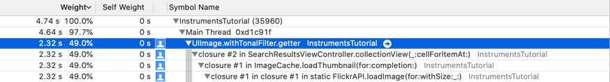
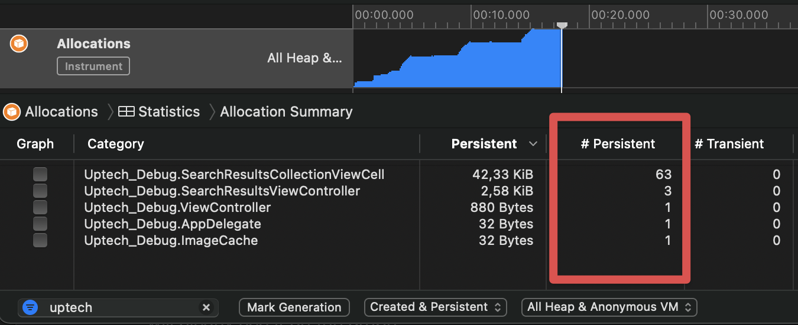
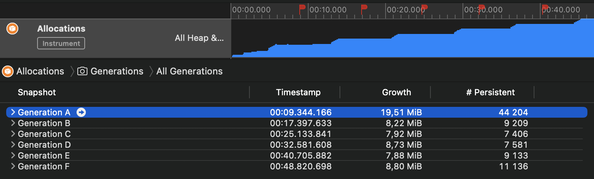

# Debugging <!-- omit in toc -->

This is a chapter about debugging tools, best practices and how we debug iOS apps in Uptech 🐞

## Debugging iOS apps <!-- omit in toc -->

- [Best practices](#1-best-practices)
- [LLDB](#2-LLDB)
  - Breakpoints
  - Expressions
- [Xcode Instruments](#3-Xcode-Instruments)
  - View debugger
  - Time profiler
  - Allocations
  - Memory debugger
  - Battery
- [Logging](#4-Logging)
- [Useful tools](#5-Useful-tools)

 

### 1. Best Practices

Something about this

### 2. LLDB

LLDB

#### Breakpoints

#### Expressions


### 3. Xcode Instruments

Xcode instruments is a set of powerful tools to use **while** developing apps for iOS/macOS. Although we were tempted to dive deep into every one of them, not all of them are necessary on a day-to-day basis. Instead, lets cover ones that should be used to test and debug every app.

#### View Debugger

#### Time Profiler

The Time Profiler instrument gives insights into the system’s CPUs and how effective multiple cores and threads are used. Basically - how good your app is performing.

❕Always profile on a physical device, because your mac has a lot more horsepower

Use example:

- You made a super nice UICollectionView with pictures loaded from some API + a photo filter applied to each photo

- Everything looks great, but you notice the collectionView is not smooth as you want it to be 🧈

- You build the project for profiling (⌘+I), fire up the Time Profiler, press record and perform some scrolling in the collectionView

- After recording, you tick the "Separate by Thread" and "Hide System Libraries" settings in the call tree

  

- You notice that the main thread is loaded up to 49% by your "withTonalFilter" function. That's the photo filter!

- You go into the function declaration and send this bad boi to a background thread, so that he no longer blocks the collectionView layout on the main thread

Call tree settings:

- **Separate by State**: groups results by your app’s lifecycle state. It is useful when you have some stuff going on in the background
- **Separate by Thread**: lets you understand which threads are responsible for the greatest amount of CPU use
- **Invert Call Tree**: makes the top-level methods visible without having to click through each call tree.
- **Hide System Libraries**: only shows symbols from your own app. It’s often useful to select this option since you can’t do much about how much CPU the system libraries are using.
- **Flatten Recursion**: shows recursive functions with one entry in each stack trace, rather than multiple times.
- **Top Functions**: makes Instruments consider the total time spent in a function as the sum of the time within that function, as well as the time spent in functions called by that function. So if function A calls B, then Instruments reports A’s time as the time spent in A plus the time spent in B

#### Allocations

This instrument helps you find abandoned memory that is no longer needed, but is not released.

Generally, you'd want to make sure that all your objects are released from memory during development. A useful method is to have a deinit call in your view controllers with a print statement just to make sure that nothing is holding on to this VC after dismissal. A typical example is failing to `invalidate()` a repeating Timer object, thus, creating a strong reference cycle.

```swift
deinit {
  print("VeryNiceViewController deinit 🧹")
}
```

The allocations graph displays how much memory your app is using while running. Typically, even if your app is doing some resource-heavy work – eventually these resources have to be released from memory. If this doesn't happen – you will clearly see it on the graph.

Lets look at an example



With the allocation instrument running we performed 3 image searches by keyword, and displayed each result in a collectionView on the `SearchResultsViewController`. By typing the name of our process in the filter we can see objects from our app only. We notice that 3 instances of `SearchResultsViewController` and 63 cells are persistent in memory. That's not right!

The Transient column shows the number of objects that existed but have since been deallocated. In this case, we should have only 1 persistent VC, and the other "used" 2 - should be transient.



Here we launched the allocations instrument, ran our app, and started performing repeating actions (the same as in the last example). After each "run" - we flagged this point in time with "mark generation". After conducting 6 searches we clearly see that memory is only growing (by ~8MB each run!) and not being released. Expanding the generations and looking into the stack trace will let us identify the methods that are responsible for holding on to memory (developer initiated stack traces are highlighted and marked with a blue "person" icon).

❕It is sometimes usefull to force iOS to release some memory by simulating a memory warning (*Document ▸ Simulate Memory Warning*). This tells the system frameworks to release memory so you can be absolutely sure that the memory leak is your fault 🙃

We identified the problem, now lets look into the memory debugger to see what's going on in more detail

#### Memory Debugger

#### Battery


### 4. Logging

### 5. Useful tools

---

Further Reading:

- https://www.apple.com/business/site/docs/iOS_Security_Guide.pdf
- https://github.com/OWASP/owasp-mstg#ios-testing-guide
