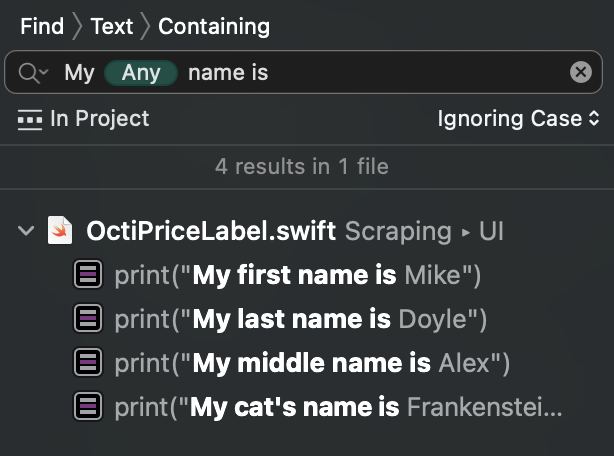
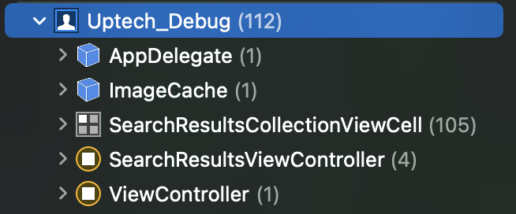
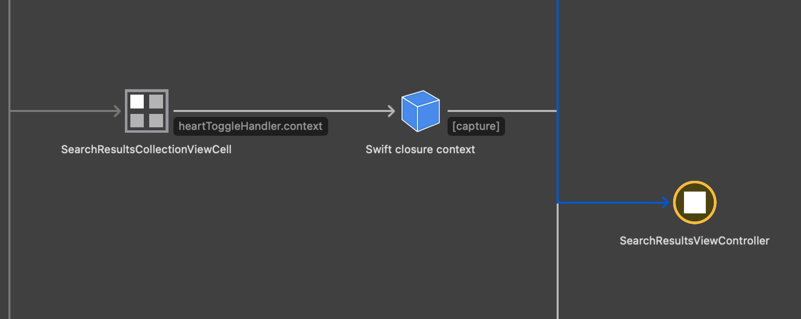
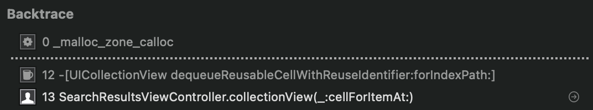

# Debugging <!-- omit in toc -->

This is a chapter about debugging tools, best practices, and how we debug iOS apps in Uptech 🐞

## Debugging iOS apps <!-- omit in toc -->

- [Best practices](#1-best-practices)
- [LLDB](#2-LLDB)
  - Breakpoints
  - Expressions
- [Xcode Instruments](#3-Xcode-Instruments)
  - View hierarchy debugger
  - Time profiler
  - Allocations
  - Visual Memory debugger
  - Battery
- [Logging](#4-Logging)
- [Useful tools](#5-Useful-tools)

 

### 1. Best Practices

Most of the time we work with code - we're debugging something. It's useful to do that efficiently to save our time and  mental health.

- Search the project efficiently

The search project feature in Xcode is not that basic as it seems. You can insert patterns with ⌃⌥⌘P, these can help you filter out unwanted stuff if searching for something generic. E.g. - find emojis by simply inserting the non-ASCII pattern, locate URLs, emails, or combine patterns with plain text to save yourself from using regular expressions and losing your mind.



Also, you can use scopes to your advantage, for example, by excluding third-party libraries, or using `File name` -> `Contains` -> "ViewController" to search only your ViewControllers (if you follow naming conventions, of course)

- Use the full potential of the simulator

Use the `Debug` -> `Slow animations` option in the simulator to debug your animations. This is useful to catch skips, jumps, and other animation glitches that are hard to notice at normal speed.

In the Xcode menu, you can toggle the `Debug` -> `View debugging` -> `Show view frames` to inspect the frames of your UI elements without pausing the app.

Install the `Network Link Conditioner` from the [Additional Xcode tools](https://developer.apple.com/download/more/?q=Additional%20Tools) package (Hardware folder) to test your app under different network conditions. The UI looks like a joke from Apple, but the functionality is solid. Choose between different profiles like Edge (for a very poor connection), 100% loss, etc.

- Ask for help

This may sound obvious, but **do** ask for help if you're stuck with some sticky issue. It might feel better to find and fix the issue by yourself, but the wasted time might not be worth it. We're sure that anyone will be glad to help a teammate in need. 🐱

### 2. LLDB

By using LLDB, you can inspect your app at runtime, evaluate expressions from the command line, inject code seamlessly, debug your UI components, and much more.

### Breakpoints

*Sometimes, a simple breakpoint is not enough.* © Albert Einstein

The simple breakpoints in Xcode are pretty powerful. Just by setting a breakpoint on a specific line and editing its properties we can:

- trigger it only on a certain **condition**.
- **ignore** the breakpoint a number of times before stopping.
- run an **action**, like a shell command or a simple LLDB command.
- **continue after execution**, which is useful when combined with actions, since we may have some actions which shouldn’t pause the app.

But Xcode generic breakpoints can do even more. They can pause the app before something bad happens, and you don't even need to know which line contains an error. Is this magic? 

These breakpoints are defined in the Breakpoints tab of the Debug navigator pane.

- **Swift error breakpoints** are great for debugging your defined errors. Instead of just terminating the app on error throw, Xcode pauses the app and lets you see what went wrong.

- **Exception breakpoints** can be used to handle UIKit, or other exceptions that are a bit "out of our hands". Sometimes the debugger just points us to the AppDelegate after terminating our app, and we are not able to understand where the problem is. In this case, set an exception breakpoint and Xcode will, again, pause your app before shooting it in the face.

- **Symbolic breakpoints** are very useful if we want to pause the execution when a specific method is called. To do so,   enter the method name in objc into the `Symbol` field of the breakpoint options. E.g. `-[UIViewController viewDidLoad]`

Additionaly, you can **share** a breakpoint by right-clicking it and hitting "share". This will create a separate file with breakpoints that could be added to git and used by other developers working on your project.

Also, if you created a breakpoint so awesome that you want to use it in all of your projects, you can add the breakpoint to the current user (right-click -> move to -> User)

A list of great breakpoints that can be used in every project can be found [here](resources/debugging/breakpoints.md). Feel free to add more!

### Expressions

By using LLDB expressions you can inject code in your project on the fly

You can inspect objects with:

- `po` - if it is a pointer to an ObjC or Core Foundation object - prints its "description" parameter, or does ` p ourObject`  if not one of those
- `p` - takes the arguments, compiles it, executes it, prints the result of the evaluation. Equivalent of `expression --`
- `e` - evaluates the given expression, displays any returned values

You can do this while the app is paused on a breakpoint, or you can configure a breakpoint to run a Debugger Command + "Automatically continue after execution". This way you can make changes flawlessly, without stopping and rebuilding the app.

The full list of LLDB commands can be found [here](https://lldb.llvm.org/use/map.html).

Writing LLDB commands by hand can get really tedious, so the good <sub>(we don't know for sure)</sub> people at Facebook created a collection of LLDB commands called **[Chisel](https://github.com/facebook/chisel)**.
Install it using the instructions in the repo and you can use the commands just like the standard ones. 

💡 Sometimes, Chisel commands can stop working. In this case, instead of rebuilding the project / reopening Xcode – run `command source ~/.lldbinit` to reload them again.

### 3. Xcode Instruments

Xcode instruments are a set of powerful tools to use **while** developing apps for iOS/macOS. Although we were tempted to dive deep into every one of them, not all of them are necessary on a day-to-day basis. Instead, let's cover the ones that should be used to test and debug every app.

### View Hierarchy Debugger

View Debugger is a cool feature that provides an interactive way to visualize view hierarchies. It is useful for identifying problems with layouts that can’t be identified by looking at a flat screen.

💁‍♀️ Often, when you're having problems with your UI layout it's worth checking in with the view hierarchy. All unexpected layout issues (like constraint ambiguity) will be displayed there.

💁‍♂️ When selecting a view in the hierarchy, it is automatically highlighted in the 3D representation. But if you see something unknown and weird in the 3D view, you have to press **⇧⌘D** to reveal it in the hierarchy

💁 It's really helpful to give your views an accessibility identifier to easily find them in the view hierarchy. The hierarchy displays objects by their class names, so if you're working with, say, `MyCoolView` and other subclasses of UIView - you're going to see names of these subclasses in the hierarchy. But if you're working with plain `UIView`'s - it's going to be hard to know which is which. By adding accessibility identifiers to your `UIViews` you can easily identify <sub>(get it? identifier -> identify haha)</sub> multiple views in the hierarchy by going into the Object inspector -> Accessibility. 

```swift
redView.accessibilityIdentifier = "RedView"
```

Plus, by doing this, if you ever run into an "UnsatisfiableConstraints" error - you're going to get the identifiers of the problematic views printed with their addresses. Neat!

### Time Profiler

The Time Profiler instrument gives insights into the system’s CPUs and how effective multiple cores and threads are used. Basically - how good your app is performing.

❕Always profile on a physical device, because your mac has a lot more horsepower

Use example:

- You made a super nice UICollectionView with pictures loaded from some API + a photo filter applied to each photo

- Everything looks great, but you notice the collectionView is not smooth as you want it to be 🧈

- You build the project for profiling (⌘+I), fire up the Time Profiler, press record, and perform some scrolling in the collectionView

- After recording, you tick the "Separate by Thread" and "Hide System Libraries" settings in the call tree

  

- You notice that the main thread is loaded up to 49% by your "withTonalFilter" function. That's the photo filter!

- You go into the function declaration and send this bad boi to a background thread so that he no longer blocks the collectionView layout on the main thread

Call tree settings:

- **Separate by State**: groups results by your app’s lifecycle state. It is useful when you have some stuff going on in the background
- **Separate by Thread**: lets you understand which threads are responsible for the greatest amount of CPU use
- **Invert Call Tree**: makes the top-level methods visible without having to click through each call tree.
- **Hide System Libraries**: only show symbols from your own app. It’s often useful to select this option since you can’t do much about how much CPU the system libraries are using.
- **Flatten Recursion**: shows recursive functions with one entry in each stack trace, rather than multiple times.
- **Top Functions**: makes Instruments consider the total time spent in a function as the sum of the time within that function, as well as the time spent in functions called by that function. So if function A calls B, then Instruments reports A’s time as the time spent in A plus the time spent in B

### Allocations

This instrument helps you find abandoned memory that is no longer needed but is not released.

Generally, you'd want to make sure that all your objects are released from memory during development. A useful method is to have a deinit call in your view controllers with a print statement just to make sure that nothing is holding on to this VC after dismissal. A typical example is failing to `invalidate()` a repeating Timer object, thus, creating a strong reference cycle.

```swift
deinit {
  print("VeryNiceViewController deinit 🧹")
}
```

The allocations graph displays how much memory your app is using while running. Typically, even if your app is doing some resource-heavy work – eventually these resources have to be released from memory. If this doesn't happen – you will clearly see it on the graph.

Let's look at an example


With the allocation instrument running, we performed 3 image searches by keyword and displayed each result in a collectionView on the `SearchResultsViewController`. By typing the name of our process in the filter we can see objects from our app only. We notice that 3 instances of `SearchResultsViewController` and 63 cells are persistent in memory. That's not right!

The Transient column shows the number of objects that existed but have since been deallocated. In this case, we should have only 1 persistent VC, and the other "used" 2 - should be transient.


Here we launched the allocations instrument, ran our app, and started performing repeating actions (the same as in the last example). After each "run" - we flagged this point in time with "mark generation". After conducting 6 searches we clearly see that memory is only growing (by ~8MB each run!) and not being released. Expanding the generations and looking into the stack trace will let us identify the methods that are responsible for holding on to memory (developer-initiated stack traces are highlighted and marked with a blue "person" icon).

❕It is sometimes useful to force iOS to release some memory by simulating a memory warning (*Document ▸ Simulate Memory Warning*). This tells the system frameworks to release memory so you can be absolutely sure that the memory leak is your fault 🙃

We identified the problem, and we can now track it down by looking into the stack trace and find the faulty methods. But to go even deeper, we can look into the Xcode memory debugger.

### Visual Memory Debugger

The Visual Memory Debugger pauses your app and displays a visual representation of objects in memory and the references between them.

❕To see the backtrace of the objects in the debugger, Malloc stack logging has to be enabled (Edit scheme -> Run -> Diagnostics -> Malloc stack logging + Live allocations only)

After you ran and used your app for a couple of cycles, go ahead and smash that Debug Memory Graph button. Usually, the first thing to do is to check whether Xcode found some obvious leaks for us. To do that – find the little ⚠️ button at the bottom of the Debug navigator pane (in the "filter" textfield). This will highlight the leaked blocks that Xcode found for us. Nice, but what do you do when Xcode doesn't see anything but your app is eating memory like it's tomato soup from Very Well Cafe?

The Debug navigator pane shows the list of all types and instances allocated in memory at the moment you paused your app. By looking at it we can again see that we have 105 collectionView cells and 4 SearchResultsVCs being held in memory.



Let's click on one of the SearchResultsVC instances. Xcode will show a pretty big graph of that instance and any references to it. We can see that there is a big amount of closures referencing the same instance of our VC.



If you select the arrow pointing to the VC and open the Utilities pane you will see that the reference type is "strong". The type of reference from the collectionViewCell to the closure is also strong. Let's select the cell to see where it is declared. 



Tapping on that small arrow will take us exactly to the place where this cell was declared. And somewhere nearby there is a closure that captures a strong reference to the SearchResultsVC and doesn't release it from memory. Make it weak and you're done. 🏄‍♂️

### Battery

It's pretty obvious that you should inspect the Energy Log on a real device, but also it's best to do that wirelessly. You can either connect the device via network (Xcode -> Devices and simulators -> Connect via network), but for the most accurate results, you can save the energy log on the device and then import it into Xcode. 
For info on how to do that, check this [Instruments Help](https://help.apple.com/instruments/mac/current/#/dev03a7149d) page

### 4. Logging

At WWDC 2020 Apple rolled out the new `Logger`, a replacement for the `os_log` logger. 
It's a new unified logging API to gather, process log messages, and help debug unexpected behavior.

Supports string interpolation out of the box and is generally easy to use. But there's a catch, to access the logs, one would need to use `OSLogStore`, which works ok on the Mac, but is not yet available on iOS. It's a fun story actually, check it out [here](https://steipete.com/posts/logging-in-swift/).

Usually, loggers have some different logging types that look something like this: 

- Debug - Useful only during debugging
- Info - Helpful but not essential for troubleshooting
- Notice - Essential for troubleshooting
- Error - Error seen during execution
- Fault - Bug in the app

The most commonly used Logging 3-d party solutions are [SwiftyBeaver](https://github.com/SwiftyBeaver/SwiftyBeaver) and [CocoaLumberjack](https://github.com/CocoaLumberjack/CocoaLumberjack).
On many Uptech projects, [Sentry](https://sentry.io) is used as a crash logging tool. It automatically captures the crash info with the stack trace and all the good stuff and sends it to the server.

### 5. Useful tools

A list of commonly used frameworks for iOS projects

### Proxyman/Charles/NetFox

[Proxyman](https://proxyman.io) and [Charles](https://www.charlesproxy.com) are both macOS apps, which enable developers to view HTTP/HTTPS requests from apps and domains, including iOS devices and iOS Simulators. They are pretty similar in functionality, check out a small comparison [here](https://proxyman.io/blog/2019/10/Alternatives-for-charles-proxy-and-wireshark.html).

How to setup Proxyman for [iOS device](https://docs.proxyman.io/debug-devices/ios-device) and [Simulators](https://docs.proxyman.io/debug-devices/ios-simulator)

[NetFox](https://github.com/kasketis/netfox) is a framework with similar functionality, but it has to be integrated into your app. 

### ControlRoom

[Control Room](https://github.com/twostraws/ControlRoom) is a nice macOS app that gives you great control over iOS simulators. Change the appearance, send notifications, record videos, and change location + locale.

### RocketSim

[RocketSim](https://www.rocketsim.app) is another great app that extends the capabilities of your simulators. It records videos (lets you save them as mp4 or GIF 👍), shows touches, and has an awesome feature that lets you compare your screens with designs. Just copy a screen from somewhere (Figma, Sketch) and paste it in the simulator - and the screen will split in half so you can easily see where your UI is a bit off. The free version lets you do this only 10 times, but the pro version is just $14 per year. Totally worth it. Also, it's developed by the creator of SwiftLee, check out his article [here](https://www.avanderlee.com/workflow/rocketsim-simulator-recording/)

### Reveal

[Reveal](https://revealapp.com) is a powerful runtime view debugging library. It’s great for quickly trying out different colors or constraint offsets and allows you to adjust your running app on the fly. It can be attached using CocoaPods or a specialized breakpoint in Xcode. It is paid, but has a free trial. Check out this [article](https://cocoacasts.com/view-debugging-with-reveal) for more info.


---

Further Reading:

- https://www.raywenderlich.com/16126261-instruments-tutorial-with-swift-getting-started
- https://medium.com/uptech-team/tips-tricks-for-ios-app-debugging-d715a02dc7d9#1967
- https://developer.apple.com/videos/play/wwdc2016/410/
- https://developer.apple.com/videos/play/wwdc2018/412/
- https://www.avanderlee.com/category/debugging/
