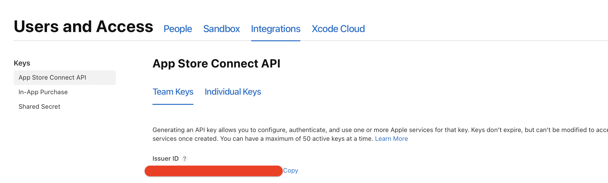

# CI/CD

Continous Integration is an important part of our development process. It allows us to move fast and be confident in our code. We use [fastlane](https://fastlane.tools) and [CircleCI](https://circleci.com) for the continuous integration.

# App Configurations

We maintain 4 different app configurations:

1. **Development** - used for the local development only.
2. **QA** - used for internal QA testing.
3. **Staging** - public Beta testing.
4. **Production** - App Store version.

# Workflow

CI/CD Workflow consist of several pipelines:
1. **Test Pipeline** - each commit in `feature/` branch triggers a Test Pipeline. Test pipeline verifies that app can be built and tests successeds.
2. **Automatic Deploy Pipeline** - each commit in `develop` branch triggers an Automatic Deploy Pipeline. This pipeline builds, tests the app, deploys a **QA** build and bumps build number of the app.
3. **Manual Deploy Pipeline** - is triggered manually via API call to our CI provider. CI takes the latest code on `develop` or `master` and deploys **Staging** or **Production** build accordingly.


# How to setup CI/CD for your project?

## 1. Setup fastlane

fastlane is a shortcut for day-to-day developers tasks. It saves our time by automating the boring things like building and deploying the app or adding a device to the developer profile.

fastlane scripts are written in Ruby. The main file is called **Fastfile**. Usually Fastfile consists of several **lanes**. Lane is just a sequence of **actions**, such as `build_ios_app`, `hockey` or `slack`. For more information refer to the [docs](https://docs.fastlane.tools). 

#### Basic Setup

The [basic Fastfile](resources/Fastfile-Basic) contains the minimalistic set of lanes, needed to build and deploy a project on a CircleCI. Lane `test` just builds the project and runs the tests suite. Usually, this lane is run on every push to any branch. Lane `deploy` is a bit more complicated as it has more steps:

1. Retrieve certificates using `match`.
2. Build the app.
3. Deploy an app to the HockeyApp
4. Send a message to the slack channel.

`deploy` lane is run on every merge to the `develop` branch.

#### Advanced Setup

Usually, basic setup is not enough, as we have several application configurations and we deserve to have nice things. In the [advanced Fastfile example](resources/Fastfile-Advanced) you can check typical fastlane configuration used in our projects. There are lanes for running tests, deploying Staging and Production builds, helper lanes for syncing provisioning profiles and adding a new iOS device to the developer profile.

Whoa, a lot of Ruby code! Don't be afraid, it's pretty easy to follow. In addition, setting up the fastlane on the project makes you feel like a cool dev-ops 😎 

Code signing part is described in the [code signing chapter](2-code-signing.md). If you use match there will be no problems, just grant your CI machine SSH access to the certificates repo.

## 2. Configure the Github Actions
### Overview
GitHub Actions allows us to automate, customize, and execute software development workflows directly in our GitHub repositories. It supports CI/CD, helping in building, testing, and deploying code.
### Prerequisites
Before you start, ensure you have:

Link to ready repository with project: [Project](https://github.com/uptechteam/githubActionsIOS)
* A GitHub repository for your iOS project, and repository for your ceritificates, (ios-certificates in Uptech).
* Fastlane set up in your project. You can follow the iOS getting started guide to initialize [Fastlane](http://docs.fastlane.tools/getting-started/ios/setup/).
 
Prerequisites:

First of all you need to set up fastlane, you can do that with that link: 
You’ll end up with a fastlane directory, a Fastfile, and an Appfile.

We will use the following Fastlane tools for automated deployment:

* ```app_store_connect_api_key```: Authenticates with the App Store Connect API using a private key instead of a username and password, enhancing security and streamlining the deployment process.
* ```match```: Manages code signing certificates and provisioning profiles across machines and team members, ensuring consistency in development and production environments.
* ```slack```: Integrates Fastlane with Slack for notifications and updates directly in your Slack channels, facilitating team collaboration and keeping everyone informed about the deployment process.

### Step 1: Initialize the Fastlane

1. To initialize Fastlane for your project, first, open up your Xcode workspace and change the Bundle Identifier to match your project’s unique identifier.


2. Navigate to the “ios” directory in your project and run the command  
   ```bundle exec fastlane init``` or ```fastlane init```

3. It will ask you about option, choose number 4, then enter:


3. Enter your Apple ID developer credentials when prompted, could ask for it a little bit later, and choose whether you want Fastlane to create the App ID and App on App Store Connect for you.
If you choose to have Fastlane create these items, it will generate them for you automatically.


4. Finally, Fastlane will generate two files for you — an Appfile and a Fastfile — which you can modify to suit your specific deployment needs, also GemFile with all gems needed.


5.  Try to run   ```fastlane custom_lane  ``` to check if everything is working without errors.


### Step 2: Initialize the match
Match guide: [Match](https://docs.fastlane.tools/actions/match/)

1.  If your GitHub repo is already created, run the following command in your terminal:
```fastlane match init ```


2.  Select git option.


3.  Paste ssh git repository url you just created when prompted.


4. Remember all entered info, passphrase is very important, if you are using uptech repo for certificates use passphrase which is in OnePass.


5. Create new bundle and app in apple connect and developer account.


Update fastlane/Matchfile to the following, changing the placeholders with the appropriate information:

```
git_url "git@github.com:awesomeRepository/ios-certificates.git" # Certificates repository url
git_branch "ci-githubActions-ios" # Your branch with the cerificates
app_identifier(["com.uptech.ci-fastlane-githubActions"]) # The bundle identifier(s) of your app
team_id "XXXXXXXXXX" # The bundle identifier(s) of your app

# Note: If you don't have permission to edit the Fastfile, change file permissions using:
* chmod -R u+w "/pathToYourFastlaneFolder"
* sudo chown -R $(whoami) "/pathToYourFastlaneFolder"
```

If you do multiple build for each environment, you need to provide all your app identifiers in the app_identifier, this case, I only have one.  
```Example: app_identifier(["<your bundle identifier 1>","<your bundle identifier 2>"])```

execute the command ``` fastlane match development ``` to generate the required certificates and files for local iOS device development. During the process, you will be prompted to provide a passphrase for Match storage, which should be remembered as it will be needed to decrypt the generated files.

5.  Fill the rest info.

6.  To create the necessary certificates and files for Testflight deployment, run ```fastlane match appstore```. As this is the second time Match is being executed, it will automatically remember the previously provided passphrase for decryption.

When all actions will be done, you will see this message


### Step 3: Configure xcode

* First, make sure in XCode that automatically manages signing is not checked.
```NOTE: If you have an error: Provisioning profile "match Development com.uptech.ci-fastlane-githubActions" doesn't include signing certificate "XXXXXXX" then: go to Apple developer Profiles, find your, tap edit, add your account, save, download and open.```


* Set Debug to match Development <bundleIdentifier> and Release to match AppStore <bundleIdentifier> for Provisioning Profile.


* Check Signing & Capabilities to ensure that everything is set up correctly.


* Finally, run your app on an iPhone device or simulator to confirm that it’s working properly.


### Step 4: Generate auth key in Apple Development Portal

Generate auth key in Apple Development Portal, go to https://appstoreconnect.apple.com/access/api
You can only generate those keys if you are the owner of the account.
The image below shows where you can get your key id and issuer id.


Once you generate the key, make sure to securely download and store the .p8 file as you will only have one chance to do so. 
Losing the file would require generating a new key.

### Step 5: Update AppFile

```
Make sure your fastlane/Appfile should look like this.
itc_team_id(ENV["ITUNES_TEAM_ID"]) # App Store Connect Team ID
team_id(ENV["APPSTORE_TEAM_ID"]) # Developer Portal Team ID
```
Link how to find ID: [Team ID](https://sarunw.com/posts/fastlane-find-team-id/)

### Step 5: Update FastlaneFile
Here is filled fastlane file here: [Faslane github actions](resources/Fastfile-GithubActions)


#### Add different plugins:
Here is docs for adding plugins: https://docs.fastlane.tools/plugins/using-plugins/

In our files, we use mint and slack which means you need to have plugin file with this plugins:
```
# Autogenerated by fastlane
#
# Ensure this file is checked in to source control!

gem 'fastlane-plugin-mint'
gem 'fastlane-plugin-slack_bot'

```

### Step 6: Set upGithub pipelines

1. Take your ssh key, if you do not have then setUp one:

To set up an SSH key for your match repository ( the repository you use to store certificates ), navigate to the “Deploy keys” section in the repository’s settings.
Generate an SSH key pair by running the command ```ssh-keygen -t rsa -b 4096 -C <your apple email here>``` and save it wherever convenient. 
Leave the passphrase empty. If you already used that ssh somewhere you can also use ssh-keygen -t ed25519 -C "YOUR_EMAIL" to generate ssh key.


2.  Next, add the newly generated public key by running cat path/to/the/key.pub and copying the contents of the file. Paste this value into the appropriate field in the setting -> “Deploy keys” section and save the changes. The key can be named as desired.


### Step 7: Add github secrets

Now it’s time set up github secrets for your main project repository. Open your main project repo and navigate to settings and in the left menu you will see secrets and variables -> actions.
Add the following keys to your secrets.
Here is link with additional info: [Match](https://docs.fastlane.tools/actions/match/)

1.  Secret: APP_STORE_CONNECT_API_KEY_ISSUER_ID

    Value: Copy it from app connect:
    


2.  Secret: APP_STORE_CONNECT_API_KEY_KEY

    Value: Key you generated in Step 4, all data in file


3.  Secret: APP_STORE_CONNECT_API_KEY_KEY_ID

    Value: Id of Key you generated in Step 4, example:
    
4.  Secret: FASTLANE_USER

    Value: Fastlane user you created before


5.  Secret: MATCH_GIT_BASIC_AUTHORIZATION

    Value:
    [To generate your base64 key according to RFC 7617, run this:](http://docs.fastlane.tools/actions/match/)

    ``` echo -n your_github_username:your_personal_access_token | base64```


6.  Secret: MATCH_PASSWORD

    Value: Enter your match password you entered before.


7. If you are running github action and this error occured: Unable to access certificates repo, try to do this add:
    
    KEY: SSH_PRIVATE_KEY

    Value: Content of your ssh private file

    Later add uses to your job: [Uses](https://github.com/marketplace/actions/webfactory-ssh-agent)

### Step 8: Setup github actions workflow
Full documentation you can see here: [GitHubActions](https://docs.github.com/en/actions/quickstart)


Create Workflow Directory
Create a directory for your GitHub Actions workflows in your repository.
Navigate to your GitHub repository, select the "Create new file" option, and enter the following path: .github/workflows/pullRequest.yml.

Note: The filename pullRequest.yml is an example and can be customized to reflect the purpose of your workflow. For instance, you might name it ci.yml for continuous integration tasks, but another part should be exactly ``` .github/workflows ```.

* Here is an example of basic job: [GitHubAction Basic file](resources/gitHubAction-Basic.yml), this job will run unit tests each time you make PR into develop branch.
* You can do more actions if you want, here is file of advanced:   [GitHubAction Basic file](resources/gitHubAction-Advanced.yml) it wont be triggered automatically, it is need to be triggered manuallyfrom github.

#### Change apple account:
Docs: [Nuke](https://docs.fastlane.tools/actions/match_nuke/)

If you want to change your Apple account or delete certificates to create a new one, you need to do the following:
```
fastlane match nuke development   
fastlane match nuke distribution

NOTE: Be careful with NUKE, to not delete other certificates and profiles.
```

#### Working with different targets:
If your project has a different targets you need to create job for each target like here:


They are similiar, but calls lanes with different parameters, example:

```
build_configuration:development
build_configuration:production
```

#### Final Steps
* Commit and Push: Commit your workflow files and push them to your repository.
* Trigger Workflows: Open a pull request to the develop branch to see the pull request workflow in action. Manually trigger the deployment workflow from the Actions tab on GitHub.


### 3. PROFIT 🚀

- we've automated part of our workflow;
- our code is always buildable and tests are green;
- the latest executable build is always available to download.
