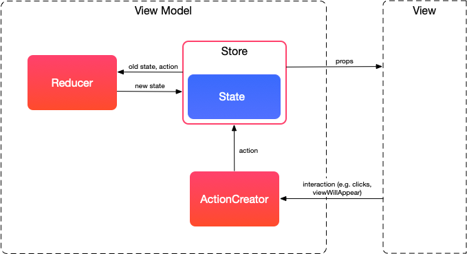

- [Motivation](#motivation)
  - [Three Redux Principles](#three-redux-principles)
- [Redux View Model](#redux-view-model)
  - [State](#state)
  - [Actions](#actions)
  - [Reducer](#reducer)
  - [Store](#store)
  - [Props](#props)
  - [View Model](#view-model)
- [Advanced usage](#advanced-usage)
  - [Async Actions](#async-actions)
  - [Action Creators](#action-creators)
  - [Middleware](#middleware)

# Motivation

As applications complexity grows, our code must manage more state than ever before. And all of us know that [a shared mutable state is bad](https://softwareengineering.stackexchange.com/a/148109).

That's where [Redux](https://redux.js.org) comes in and attempts to **make state mutations predictable**.

## Three Redux Principles

**1. Single source of truth**

The state of your whole application is stored in an object tree within a single store.

**2. State is read-only**

The only way to change the state is to emit an action, an object describing what happened.

**3. Changes are made with pure functions**

To specify how the state tree is transformed by actions, you write pure reducers.

Please refer to the [official Redux ReadMe](https://redux.js.org) for more. It has tons of useful information.

# Redux View Model

We are not trying to port Redux on iOS, instead, we applied core principles to our View Models. It helps us to scale complexity linearly and build even the most complicated screens with ease.

Redux Components in iOS:



Redux View Model consists of the following parts:

1. **Actions** that are payloads of information that send data from your application to your store. You send them to the store using `store.dispatch()`.
2. **Reducers** specify how the application's state changes in response to actions sent to the store. Remember that actions only describe _what_ happened, but don't describe _how_ the application's state changes.
3. **Store** is an object that brings Actions and Reducers together. It provides a way to dispatch Actions and observe State changes.

Let's take a more in-depth look at all of them.

## State

The State is a plain struct that holds only data that is required to render a view.
It's not meant to be exposed from the view model to other architecture components anyhow and must be used by view model's parts only.

```swift
struct TeamChatState {
  var messages: [Message]
  var isLoadingMessages: Bool
}
```

## Actions

Actions are data structures that represent a state modification. We tend to use `enum` to declare all possible actions for the Store, but you may also use `struct`s if you feel an urge to.

```swift
enum TeamChatAction {
  case loadMessages
  case loadMessagesSuccess([Message])
  case deleteMessage(id: Message.Identifier)
}
```

## Reducer

Reducer is a _pure_ function that applies actions to the state. It is important to keep it pure and implement it without side effects to be sure that the only way of modifying state is dispatching actions.

```swift
extension TeamChat {
  static func reduce(state: TeamChatState, action: TeamChatAction) -> TeamChatState {
    var state = state

    switch action {
    case .loadMessages:
      state.isLoadingMessages = true

    case let .loadMessagesSuccess(newMessages):
      state.messages.append(newMessages)
      state.isLoadingMessages = false

    case let .deleteMessage(messageIdToDelete):
      state.messages.removeAll(where: { $0.id == messageIdToDelete })
    }

    return state
  }
}
```

You might notice that in the example above we don't actually load the messages when a `.loadMessages` action is dispatched. That's because reducers are pure and can't perform network requests. On how to perform asynchronous changes a bit later.

## Store

A Store should meet the following requirements:

- hold application state;
- allow an access to the current state value;
- allow the state to be updated via `dispatch(action)`;
- allow the state to be observed.

A Store can be easily implemented with or without a reactive framework and be reused in each view model. Here is how the API can look like.

```swift
final class ReduxStore<State, Action> {
  typealias Reducer = (State, Action) -> State

  let state: Observable<State>

  init(initialState: State, reducer: @escaping Reducer)

  func dispatch(_ action: Action)
  func getState() -> State
}
```

You are free to implement the Store yourself or grab one we use - [ReduxStore](resources/ReduxStore.swift).

## Props

Props are described in [the Architecture chapter](4-architecture.md#props). They are just bags of data, that are passed to the View to render the current State.
To map state into props we use a free pure function `makeProps(from state: State) -> Props`. A function is pure to make sure props (visual representation) depends only on the current state.

```swift
extension TeamChat {
  static func makeProps(from state: TeamChatState) -> TeamChatProps {
    return TeamChatProps(
      messages: makeMessages(from: state),
      title: makeTitle(from: state)
    )
  }

  private static func makeTitle(from state: State) -> String {
    return state.isLoadingMessages ? "Loading" : "Chat"
  }

  private static func makeMessages(from state: State) -> [TeamChatProps.Message] {
    return state.messages
      .map { message -> TeamChatProps.Message in
        return TeamChatProps.Message(
          body: message.body,
          senderName: message.sender.name,
          senderAvatarUrl: message.sender.avatarUrl,
          createdAt: message.createdAt
        )
      }
  }
}
```

## View Model

A View Model is a part that combines and wraps all other parts using a reactive framework.
Here you can also see how asynchronous actions are handled with a `loadMessagesAction` and `loadMessagesSuccessAction`.

```swift
final class TeamChatViewModel {
  struct Inputs {
    let loadMessages: Observable<Void>
    let deleteMessage: Observable<Message.Identifier>
  }

  struct Outputs {
    let props: Observable<TeamChatProps>
  }

  func makeOutputs(from inputs: Inputs) -> Outputs {
    // 1. Create a Store
    let initialState = TeamChatState(messages: [], isLoadingMessages: false)
    let store = ReduxStore<TeamChatState, TeamChatAction>(initialState: initialState, reducer: TeamChat.reducer)

    // 2. Map inputs into the Actions
    let loadMessagesAction = inputs.loadMessages
      .map { TeamChatAction.loadMessages }

    let loadMessagesSuccessAction = inputs.loadMessages
      .flatMap { () -> Observable<TeamChatAction> in
        return chatService.loadMessages()
          .map(TeamChatAction.loadMessagesSuccess)
      }

    let deleteMessageAction = inputs.deleteMessage
      .map(TeamChatAction.deleteMessage)

    let actions = Observable.merge([
      loadMessagesAction,
      loadMessagesSuccessAction
      deleteMessageAction
    ])

    // 3. Subscribe for Actions to dispatch them into Store
    actions
      .subscribe(onNext: store.dispatch)
      .disposed(by: disposeBag)

    let props = state
      .map(TeamChat.makeProps(from:))
      .share(replay: 1, scope: .forever)

    return Outputs(props: props)
  }
}
```

# Advanced usage

## Async Actions

When you call an asynchronous API, there are two crucial moments in time: the moment you start the call, and the moment when you receive an answer (or a timeout).

Each of these two moments usually requires a change in the application state; to do that, you need to dispatch normal actions that will be processed by reducers synchronously. Usually, for any API request you'll want to dispatch at least three different kinds of actions:

**1. An action informing the reducers that the request began.**

The reducers may handle this action by toggling an `isFetching` flag in the state. This way the UI knows it's time to show a spinner.

**2. An action informing the reducers that the request finished successfully.**

The reducers may handle this action by merging the new data into the state they manage and resetting `isFetching`. The UI would hide the spinner, and display the fetched data.

**3. An action informing the reducers that the request failed.**

The reducers may handle this action by resetting `isFetching`. Additionally, some reducers may want to store the error message so the UI can display it.

## Action Creators

There is plenty of boilerplate needed to map View Model Inputs into Actions. We can encapsulate all of that into Action Creator class.

```swift
final class TeamChatActionCreator {
  let actions: Observable<TeamChatAction>

  init(inputs: TeamChatViewModel.Inputs, chatService: ChatService) {
    let loadMessagesAction = inputs.loadMessages
      .map { TeamChatAction.loadMessages }

    let loadMessagesSuccessAction = inputs.loadMessages
      .flatMap { () -> Observable<TeamChatAction> in
        return chatService.loadMessages()
          .map(TeamChatAction.loadMessagesSuccess)
        }

    let deleteMessageAction = inputs.deleteMessage
      .map(TeamChatAction.deleteMessage)

    self.actions = Observable.merge([
      loadMessagesAction,
      loadMessagesSuccessAction
      deleteMessageAction
    ])
  }
}
```

## Middleware

Redux is a pretty simple framework, however, it's designed with a lot of care and thought. Redux supports a rich extension method called Middleware. **Middleware provides a third-party extension point between dispatching an action, and the moment it reaches the reducer.** We can use middlewares for logging, talking to an asynchronous API, playing sounds, and more.

Let's take a look on a simple logging middleware:

```swift
extension TeamChat {
  static func makeLoggingMiddleware(logger: Logger) -> TeamChat.Store.Middleware {
    return { dispatch, getState in
      return { next in
        return { action in
          logger.log("dispatching: \(action)")
          let oldState = getState()
          logger.log("old state: \(oldState)")

          next(action)

          let newState = getState()
          logger.log("new state: \(newState)")
        }
      }
    }
  }
}
```

Whoa, that's a lot of nested closures! The reason for this is that middleware wraps a `dispatch` function and allows to have chained middlewares. It makes this possible with by tons of tons of functional concepts including high-order functions, function composition, and currying.

Let's understand what each argument is for.

```swift
return { dispatch, getState in
```

1. `dispatch: (Action) -> Void` argument is a function, that allows to dispatch any additional action to the store from the middleware.

2. `getState: () -> State` argument is a function that always returns current State of the Store.

```swift
  return { next in
    return { action in
```

3. `action: Action` is the action that was originally dispatched to the Store

4. `next: (Action) -> Void` argument is used to dispatch the action to the next middleware in the chain.

What happens when this middleware executes:

1. Firstly we log currently dispatching action.
2. We capture and log the state before the action arrived with `getState()` function.
3. We dispatch action down the middlewares chain with `next(action)`.
4. All downstream middleware functions in the chain are invoked.
5. The reducer functions in the store are called with the action payload.
6. The logger middleware then gets the resulting next state with `getState`.

---

**It's very important to pass the action down the middlewares chain with `next(action)` otherwise action will never get to the reducer.**

---

Middlewares are capable to dispatch actions asynchronously, so now we can move messages fetching logic into its own middleware:

```swift
static func makeMessagesLoaderMiddleware(chatService: ChatService) -> TeamChat.Store.Middleware {
  let disposeBag = DisposeBag()
  return { dispatch, getState in
      return { next in
        return { action in
          next(action)

          guard case TeamChatAction.loadMessages = action else {
            return
          }

          chatService.loadMessages()
            .subscribe(onNext: { messages in
              // Here we are dispatching the action with loaded messages.
              let action = TeamChatAction.loadMessagesSuccess(messages)
              dispatch(action)
            })
            .disposed(by: disposeBag)
        }
      }
    }
}
```

Unfortunately, the currying functions syntax looks a bit off. So if you want (like me) to simplify it a bit, you can implement your own helper function, e.g.

```swift
makeMiddleware { dispatch, getState, next, action in ... }
```

Middlewares is a very powerful mechanism that helps us extend default simple Redux architecture. You may use provided [ReduxStore](resources/ReduxStore.swift) that supports Middelwares.
