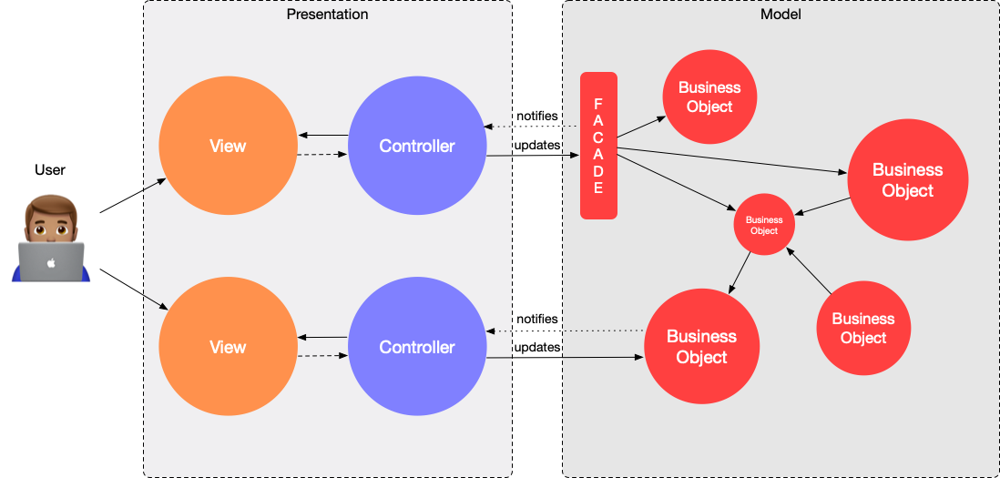

# Architectural Principles <!-- omit in toc -->

This chapter defines ground ideas and architectural principles we follow at Uptech.

- [Background](#background)
  - [What is a Good Architecture?](#what-is-a-good-architecture)
  - [MVC](#mvc)
  - [What is MVC?](#what-is-mvc)
  - [Domain and Presentation](#domain-and-presentation)
  - [MVVM, MVP, VIPER, React/Redux and friends](#mvvm-mvp-viper-reactredux-and-friends)
  - [Conclusion](#conclusion)
- [Cooking Recipes](#cooking-recipes)
  - [1. UIViewController is a part of the Presentation layer](#1-uiviewcontroller-is-a-part-of-the-presentation-layer)
  - [2. Rich Domain Model](#2-rich-domain-model)
  - [3. Don't fight the iOS SDK](#3-dont-fight-the-ios-sdk)
  - [4. Create other classes in the Presentation layer if you need it](#4-create-other-classes-in-the-presentation-layer-if-you-need-it)
  - [5. Aim for the simplest solution first](#5-aim-for-the-simplest-solution-first)
  - [6. Rx as a tool for asynchronous programming](#6-rx-as-a-tool-for-asynchronous-programming)
    - [Futures](#futures)
    - [Observer Pattern](#observer-pattern)
  - [7. Redux](#7-redux)
- [Future Directions](#future-directions)
  - [Sources:](#sources)

# Background

## What is a Good Architecture?

We can say that architecture is good when it follows a couple of traits:

- each object has **a specific, clear role**. It's easy to understand, easy to change, and when you go and read the source code, you immediately see whether this is actually fulfilling that single role or whether logic you are about to write would breach it.

- **data flow is simple**. You can easily debug a crash or an error, there is no need to jump across multiple different objects, mutating the same shared resource.

- **changes are cheap**. The architecture **is flexible** because it's simple to understand and simple to change, but not because it has 200 abstraction layers and everything is abstracted to the point when nothing is comprehensible.

## MVC

Famous "Cocoa MVC" diagram from the [official Apple documentation](https://developer.apple.com/library/archive/documentation/General/Conceptual/DevPedia-CocoaCore/MVC.html):


MVC is a standard Cocoa architectural pattern, which received a lot of criticism and was blamed for causing too much code in one place and too closely coupled code ("Massive View Controller").

Very often MVC is interpreted as follows:

- **Model** - data entities of our application (structs such as `User`, `Book` or `Balance`);
- **View** - what user sees (subclasses of the `UIView`);
- **Controller** - mediator between View and Model, which takes care of all the rest (networking, persistence, business logic, etc).

But what if we misinterpreted the original idea of MVC? What if MVC is not just three classes "data, view and the rest"?

## What is MVC?

MVC is a result of a very huge work. It was invented by Trygve Reenskaug as a result of his work on the Dynabook project at Xerox PARC in 1979. This project was going for about 10 years. Reenskaug summarized the main ideas and solutions in GUI application development that were accumulated during these 10 years in MVC.
And it wasn’t like “Hey, we created a universal pattern in 10 years that you should use to solve any problem”. It is a fundamental mistake we made.

**MVC is not a pattern, it's a philosophy.** It is not a scheme of app’s modules decomposition. MVC is one of the first attempts to formalize main ideas working with apps with GUI. These ideas are still relevant and [not only](https://dotnet.microsoft.com/apps/aspnet/mvc) [for the](https://hackernoon.com/from-mvc-to-modern-web-frameworks-8067ec9dee65) [iOS platform](https://docs.spring.io/spring/docs/3.2.x/spring-framework-reference/html/mvc.html).

Please, read [the original MVC reports](http://folk.uio.no/trygver/2007/MVC_Originals.pdf) and [The Model-View-Controller. It's Past and Present](http://heim.ifi.uio.no/~trygver/2003/javazone-jaoo/MVC_pattern.pdf) if you want to know more, it's quite fascinating.

**One of the main principles of MVC is to divide all our code to Presentation and Domain Model.**

## Domain and Presentation

**Domain Model** is the core of our application. It is the main part of it. It consists of several business objects, for example, entities such as account, product, transaction and so on. And the logic around these objects is called business logic. For example, “if the user has little money on the account, give him a discount”. _Domain Model_ can consist of one object as well as a whole system of objects. It depends on how complex business logic is.

**Presentation** is what users can see and interact with. In MVC the View and Controller are parts of Presentation.

MVC philosophy in iOS:



## MVVM, MVP, VIPER, React/Redux and friends

A lot of different approaches and patterns were spawned to solve _(inexistent)_ "Massive View Controller" problem. On paper, they have noble goals that should help separate data model, business logic, model-view communication and put everything in its place. But practically most of them move a big ball of ~~mud~~ Domain logic from the ViewController into ViewModel/Presenter/Store/(put your container here), leaving the original problem unsolved.

Thus, we can't call such patterns an architecture. **They are not an alternative to MVC**, but a scheme of a single module decomposition in the _Presentation_ layer.

To be clear, there is nothing wrong with any of these patterns. Even though the _Domain Model_ contains most of the app state, we can't get rid of some stateful logic in the _Presentation_ layer. It includes view state, navigation logic or responding to the view lifecycle events. Such patterns solve problems in unique and interesting ways and can help you improve your _Presentation_ layer code.

For example, MVVM makes some of the _Presentation_ code testable. Redux encapsulates a state of the module into a single object and guarantees that all the UI updates are synchronized with a module state.

With that being said, the simplest solution is often the best one. Don't fight with iOS SDK, embrace and leverage the tools the platform gives us.

## Conclusion

Don’t try to use MVC as one single structural design pattern but rather as a guideline for good application architecture, or a set of design patterns that can solve some of our problems.

# Cooking Recipes

... or a "Good Architecture" best practices.

## 1. UIViewController is a part of the Presentation layer

If you write there a business logic, network requests or anything else that doesn't relate to the user interface, it is not MVC.

## 2. Rich Domain Model

Make your Domain Model smart. Use [design patterns](https://en.wikipedia.org/wiki/Software_design_pattern#Classification_and_list), unleash your engineering creativity here but be consistent. Keep in mind [our definition of a "Good Architecture"](#what-is-a-%22good-architecture%22).

Requirements to the Domain Model:

- Model must be encapsulated and must not reference the view or application framework;
- The Model interface must expose actions, not primitive data operations;
- Updates may occur only in response to change notifications from the Model.

These requirements are the minimum for any application design.

**Advice:**

Use [**Facade** pattern](https://en.wikipedia.org/wiki/Facade_pattern) to build a nice API for your Presentation layer to use. Facades helps hide complex object graph of Domain model behind a single object. Example:

```swift
protocol TodoListFacade {
    var tasksListDidChange: Observable<Void> { get }

    var tasks: [Task] { get }

    func createNewTask(name: String, dueDate: Date?)
    func markTaskAsCompleted(id: Task.ID)
    func removeTask()
}
```

_Notice that all the methods which update the model don't return any value. Presentation layer doesn't care about a result of the model update and updates itself only in response to notifications._

## 3. Don't fight the iOS SDK

Fighting with iOS SDK is impossible and any attempt to do this complicates the system. As soon as we stop fighting with iOS SDK, all these staffs become useful. The SDK starts to help us and benefit.

- Use patterns that iOS frameworks – especially UIKit – are already based on.
- MVC, Delegate, Dependency Injection, Target / Action

## 4. Create other classes in the Presentation layer if you need it

The Presentation layer can contain a lot of logic too. If your ViewController becomes fat, use [child view controllers](https://www.swiftbysundell.com/basics/child-view-controllers/) to decompose the screen. Decouple data sources from the view controller. If things are getting out of hand, use Redux.

## 5. Aim for the simplest solution first

Apply design patterns as they are needed during the application evolution (growth of codebase) following the [YAGNI (you ain’t gonna need it)](https://en.wikipedia.org/wiki/You_aren%27t_gonna_need_it) principle, instead of choosing architecture and then trying to fit your application into it.

Rembmer that **Obvious code > Clever code.**

## 6. Rx as a tool for asynchronous programming

Rx is a handy tool that makes asynchronous programming simpler, solving [callback hell problem](http://callbackhell.com). Do not overuse Rx and don't follow Functional Reactive Programming paradigm. Keep Rx usage limited to 2 use cases: Futures and Observer pattern.

### Futures

At the time of writing this chapter, Swift doesn't support asynchronous programming primitives such as _async_/_await_. Developers have to use callbacks for any kind of asynchronous operation. This [doesn't always end up well](http://callbackhell.com).

Instead, we can resort to 3rd party libraries, such as Rx. Among a lot of concepts, RxSwift brings _Single_, which also knows as a _Future_ or a _Promise_.

**Future** object represents the eventual completion (or failure) of an asynchronous operation, and its resulting value. Future is a proxy for a value not necessarily known when the promise is created.

Futures allows to replace these code:

```swift
func fetchTodoList(completionHandler: ([Task]) -> Void, errorHandler: (Error) -> Void) {
    ...
}

func storeTask(completionHandler: () -> Void) {
  ...
}

// At a call site
fetchTodoList(
  completionHandler: { tasks in
    let group = DispatchGroup()
    for task in tasks {
      group.enter()
      storeTask {
        group.leave()
      }
    }

    group.wait()
    complete()
  },
  errorHandler: { error in  ... }
)
```

With a simpler implementation:

```swift
func fetchTodoList() -> Single<[Task]> {
    ...
}

func storeTask() -> Single<Void> {
  ...
}

// At a call site
fetchTodoList()
  .flatMap { tasks in Single.zip(tasks.map(storeTask)) }
  .subscribe(
    onSuccess: { complete() },
    onError: { error in ... }
  )
```

### Observer Pattern

**Observer pattern** is heavily utilized in Cocoa world and the SDK provides an API for that - `NotificationCenter`. The problem with a NotificationCenter is that notifications are not strongly typed, everything is `String` or `Any`. Instead, we can use generic `Observable<T>` from RxSwift to observe changes in the Domain model.

Apart from that Rx provides a lot of useful operators, such as `flatMapLatest`, `debounce` or `distinctUntilChanged`. Be aware of them, but do not overuse. Most of the asynchronous code is located in the Domain Model, so only part of the Presentation Layer that should touch Rx is subscribing to the model updates notifications.

## 7. Redux

Redux is another useful approach in our toolbelt. Originally, Redux is an implementation of the unidirectional data flow architecture, where the whole app state is represented in a single big tree-object, and mutations to this object are limited by a distinct number of actions.

This idea is also applicable to the unit of any size: whole app, single module or even just a class. Redux is an implementation detail of a single module so it doesn't affect the system. We use Redux for objects with a lot of interdependent states, it allows us to synchronize state management in a single function `reducer`. For more information refer to [the Redux chapter](4-1-redux.md).

# Future Directions

Both MVC and OOP were born around 40 years ago in the same research center Xerox PARC. Those paradigms moved the whole industry forward, made Software Engineering easier and more flexible, sped up the development processes. It's still a viable architecture solution to the app of any size. But what's next?

SwiftUI and Combine may change the way we used to build things. SwiftUI makes possible to build declarative views and drive navigation through a single app state. Knowing that and observing the growing popularity of the functional programming approaches we expect a soon sunset of the MVC, and a paradigm shift towards unidirectional data flow in the iOS development.

Keep calm and be ready for a brave new world!

---

## Sources:

- [The only viable iOS architecture –– Amirzhan Idryshev
  ](https://medium.com/flawless-app-stories/the-only-viable-ios-architecture-c42f7b4c845d)
- [Do MVC like it’s 1979 –– Bohdan Orlov
  ](https://badootech.badoo.com/do-mvc-like-its-1979-da62304f6568)
- [MVC vs MVVM vs VIPER – which to use for iOS? –– Paul Hudson](https://www.hackingwithswift.com/articles/41/mvc-vs-mvvm-vs-viper-which-to-use-for-ios)
- [Охота на мифический MVC. Обзор, возвращение к первоисточникам и про то, как анализировать и выводить шаблоны самому –– cobiot](https://habr.com/en/post/321050/)
- [The worst possible application –– Matt Gallagher](https://www.cocoawithlove.com/blog/worst-possible-application.html)
