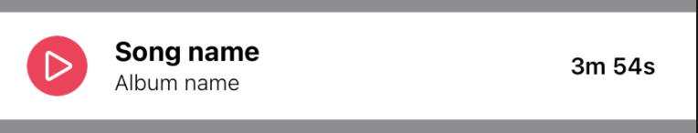

# UIKit In Code

- [Advantages](#advantages-of-ui-in-code)
- [Code formatting document for the project](#code-formatting-document-for-the-project)
- [Best practices](#best-practices)
- [Examples](#example)
    - [Example A](#example-from-project-A)
    - [Example Y](#example-from-project-Y)
    - [Example G](#example-from-project-G)
    - [Compare with StackView VS without StackView](#compare-with-stackView-vs-without-stackView)
- [References](#references)

## Advantages of UI in code

**Reasons** for defining UI in code instead of storyboards/xibs

1. Readability

    You read code more than you write it. Defining interface in code makes it possible to get familiar with certain UI without IDE, for example, while code review. Taking a look at properly structured UI code is enough to "see" the UI it describes.

2. Infinite customization possibilities

    Storyboards and xibs are built on top of UIKit code. They are higher level frameworks that have limitations. You don't have access to all the properties view has, but in code you can do whatever UIKit can do. You can even go deeper that UIKit and use some of CoreGraphics framework features. 

3. Dynamic UI

    The main limitation of storyboards/xibs are related to dynamic interface. There's no way to define any logic or relations besides segues, so all that stuff is done in code via IBActions. Why would you use something in the between UI and you to manage actions instead of defining everything directly in code? Also writing interface changes code requires looking at the interface declaration, so it's more convenient to have everything in one place - .`swift` file :) 

4. Performance

    Storyboard may take some time to load, especially if it's complex and machine is slow. Code files always open instantly because it's just text. 

5. Reusability

    Code is highly reusable, especially when written in a reusable way! Even if it's not written with reusability in mind, taking it out to a separate entity is usually pretty easy. Reusing elements from storyboards is impossible, reusing xibs is okay, but it's still far from code. 

6. Easy code review

    Reviewing xml from storyboards and xibs is a bad idea, reviewer has to check out the branch and open the file in Xcode to see the UI and constraints. Reviewing interface defined in code is much easier, because you don't need IDE to understand the layout and appearance. Code review takes even less time, when all code is formatted in a defined way with certain rules applied.

7. Merge conflicts

    Merge conflicts are inevitable. Dealing with them in storyboards/xibs is an absolute horror, while handling them in UI code is as complex as any other conflict in plain code. 

8. Writing UI code may lead to new knowledge

    While writing all the UI code "by hand", you may discover some new stuff that wasn't available with storyboards. You may also find new ways of doing transitions, learn more about some UIKit elements and other cool stuff. Working on a deeper level of abstractions is always more fun.

**Cons** of UI in code

1. No more segues

    Segues are available only in storyboards, which may be tough to leave without for some inexperienced developers. However, there are many cool ways to do the same thing in code!

2. Defining UI in code may be slower at first

    It takes some time to get used to writing UI in code, especially when coming from storyboard-based development. Don't worry, you will get comfortable with it pretty quickly 😉

## **Code formatting document** for the project

The mail goal of this cookbook page is to give you some advice on how to set up code style on your own project. Creating a guideline how to write UI in code have its benefits:

- One source of truth.
- Each developer knows and uses same code style across project.
- New developer can quickly get acquainted how to create UI in code.

**What things should be described:**

- **Code structure.**

    Describe code structure. Specify what should be defined first: is it variables, or inner types, or public functions? If you would like to separate private functions into a private extension, add some information about it.

- **View structure.**

    It is convenient to have separate functions where you add constraints and set up views. It can be one method to configure all views, one method per one view or use lazy computed properties to define views with separate methods to add constraints. Main goal is to have single way across all project.

- **Constraints.**

    Constraints are the main blocks for creating UI. Have a clear and simple way to add constraints will decrease development time. Make sure to agree on their order and document it. To get the most of this technique you have to have strict formatting everywhere.

- **How view is configured.**

    Define a single way to pass data into the view. It can be configuration with "props" structure, simple `configure` method or something else.

- **Handling interactions.**

    Describe how controller gets information about interactions from the view. Define rules for callbacks, actions or Rx or whatever you want to use.

- **Styles management.**

    Find a way to manage and define styles (fonts, colors, etc) that suites your project best, and describe it.

Also make sure you have rules for general code formatting, for ex., if you want everyone to write negative numbers in a specific way (`-1.0 * constant`), add this rule to your cookbook! Make sure everyone is aware of it and code review will become less painful.

## Best practices

- Define consistent order of subviews declaration and follow it. (e.g. It can be order of adding subviews to a view)
- If you opt for init based subview setup - group each subview setup into corresponding function. Do not let your setup function become a huge monster.

```swift
// MARK: - Lifecycle

override init(frame: CGRect) {
  super.init(frame: frame)
  commonSetup()
}

required init?(coder: NSCoder) {
  super.init(coder: coder)
  commonSetup()
}

// MARK: - Private Methods

private func commonSetup() {
  setupView()
  setupTitleLabel()
  setupHintLabel()
  setupDestinationLabel()
  setupLabelsStackView()
  setupCloseButton()
  setupSeparatorView()
}
```

- Do not mix view configuration (background color, font, tint color changes) with layout related code. If you opt for field based subview configuration - it is already done, since you shouldn't store layout related code in subview initialization anyway.

```swift
private func setupCalendarButton() {
  calendarButton.backgroundColor = UIColor.white.withAlphaComponent(0.2)
  calendarButton.tintColor = .white
  calendarButton.setImage(Asset.calendar.image)

  addSubview(calendarButton, withConstraints: [
    calendarButton.leadingAnchor.constraint(
      equalTo: doubleNextButton.trailingAnchor,
      constant: 8),
    calendarButton.trailingAnchor.constraint(
      equalTo: trailingAnchor, 
      constant: -20),
    calendarButton.bottomAnchor.constraint(equalTo: bottomAnchor),
    calendarButton.heightAnchor.constraint(
      equalToConstant: Constants.ButtonSize.height),
    calendarButton.widthAnchor.constraint(
      equalToConstant: Constants.ButtonSize.width),
  ])
}
```

- Define consistent order of constraint addition and follow it. The constraints to position are: top, leading, trailing, bottom;
centerY, centerX;
height, width.
- Use custom wrappers for subview addition and insert:

```swift
extension UIView {
  func addSubview(
    _ view: UIView, 
    withConstraints constraints: [NSLayoutConstraint]) 
  {
    addSubview(view)
    view.translatesAutoresizingMaskIntoConstraints = false
    NSLayoutConstraint.activate(constraints)
  }

  func addSubviewWithEdgeConstraints(_ view: UIView) {
    addSubview(view, withConstraints: [
      view.topAnchor.constraint(equalTo: topAnchor),
      view.leadingAnchor.constraint(equalTo: leadingAnchor),
      view.trailingAnchor.constraint(equalTo: trailingAnchor),
      view.bottomAnchor.constraint(equalTo: bottomAnchor),
    ])
  }

  func insertSubview(
    _ view: UIView,
    at index: Int = .zero,
    withConstraints constraints: [NSLayoutConstraint])
  {
    insertSubview(view, at: index)
    view.translatesAutoresizingMaskIntoConstraints = false
    NSLayoutConstraint.activate(constraints)
  }

  func insertSubviewWithEdgeConstraints(
    _ view: UIView, 
    at index: Int = .zero) 
  {
    insertSubview(view, at: index, withConstraints: [
      view.topAnchor.constraint(equalTo: topAnchor),
      view.leadingAnchor.constraint(equalTo: leadingAnchor),
      view.trailingAnchor.constraint(equalTo: trailingAnchor),
      view.bottomAnchor.constraint(equalTo: bottomAnchor),
    ])
  }
}
```

- Consider adding priority specifier method (with some custom priorities as well), so that non-required constraints can be added as a one-liner.

```swift
extension NSLayoutConstraint {
  func withPriority(_ priority: UILayoutPriority) -> NSLayoutConstraint {
    self.priority = priority
    return self
  }
}

extension UILayoutPriority {
  static let almostRequired = UILayoutPriority(999)
  static let prioritizedCompressionResistance = UILayoutPriority(751)
  static let prioritizedHugging = UILayoutPriority(251)
}
```

- Use SwiftUI preview functionality to develop UI quicker. Just add this code snippet to bottom of your file

```swift
import SwiftUI

struct ViewRepresentable<View: UIView>: UIViewRepresentable {
  let view: View
  init(_ view: View, setup: (View) -> Void = { _ in }) {
    self.view = view
    setup(view)
  }
  func makeUIView(context: Context) -> View {
    view
  }
  func updateUIView(_ uiView: View, context: Context) {
  }
}

struct YourViewPreview: PreviewProvider {
  @available(iOS 13.0.0, *)
  static var previews: some View {
    let view = YourOwnCustomView()
    return ViewRepresentable(view)
      .frame(width: 335.0, height: 68.0)
  }
}
```

- Experiment with ways you describe hierarchy. For example, you can show "preview" of it using indentations

```swift
private func setUpViews() {
  addSubview(stackView)
    stackView.addArrangedSubview(title)
    stackView.addArrangedSubview(imageView)
    stackView.addArrangedSubview(prizeNameContainer)
      prizeNameContainer.addSubview(prizeName)
    stackView.addArrangedSubview(button)
    stackView.addArrangedSubview(info)
}
```

- Helpful extension for adding corner radius:

```swift
extension UIView {
  func roundCornersContinuosly(radius: CGFloat, corners: CACornerMask = .all) {
    layer.maskedCorners = corners
    layer.cornerRadius = radius

    if #available(iOS 13.0, *) {
      layer.cornerCurve = .continuous
    }
  }
}

extension CACornerMask {
  static let all: CACornerMask = [
    CACornerMask.layerMaxXMaxYCorner,
    CACornerMask.layerMinXMaxYCorner,
    CACornerMask.layerMaxXMinYCorner,
    CACornerMask.layerMinXMinYCorner
  ]
}
```

- You can create your own code snippet files for fast View initial setup and then share them with your team. They are stored locally as .codesnippet files in /Users/[user]/Library/Developer/Xcode/UserData/CodeSnippets and can be easily exported by copying and imported by placing new files in this directory.

Examples:

[componentView.codesnippet](./resources/ui_in_code/componentView.codesnippet)

## Example



### Example from project A
<details>
    <summary>Click to expand the code</summary>

```swift
import UIKit

// MARK: - PlayerCell

final class PlayerCell: UITableViewCell {

  // MARK: - Private Properties

  private let playImageView = UIImageView()
  private let songNameLabel = UILabel()
  private let albumNameLabel = UILabel()
  private let durationLabel = UILabel()

  // MARK: - Lifecycle

  override init(style: UITableViewCell.CellStyle, reuseIdentifier: String?) {
    super.init(style: style, reuseIdentifier: reuseIdentifier)
    commonSetup()
  }

  required init?(coder: NSCoder) {
    super.init(coder: coder)
    commonSetup()
  }

  // MARK: - Accessible Methods

  func render(props: Props) {
    songNameLabel.text = props.songName
    albumNameLabel.text = props.albumName
    durationLabel.text = props.duration
  }

  // MARK: - Private Methods

  private func commonSetup() {
    setupView()
    setupPlayImageView()
    setupSongNameLabel()
    setupAlbumNameLabel()
    setupDurationLabel()
  }

  private func setupView() {
    selectionStyle = .none
    backgroundColor = .white

    NSLayoutConstraint.activate([
      heightAnchor.constraint(equalToConstant: Constants.height).withPriority(.almostRequired),
    ])
  }

  private func setupPlayImageView() {
    playImageView.contentMode = .center
    playImageView.backgroundColor = .systemPink
    playImageView.image = Asset.iconPlay.image
    playImageView.tintColor = .white
    playImageView.layer.cornerRadius = Constants.stateImageSize.height / 2
    playImageView.clipsToBounds = true

    addSubview(playImageView, withConstraints: [
      playImageView.centerYAnchor.constraint(equalTo: centerYAnchor),
      playImageView.leadingAnchor.constraint(equalTo: leadingAnchor, constant: 16),
      playImageView.heightAnchor.constraint(equalToConstant: Constants.stateImageSize.height),
      playImageView.widthAnchor.constraint(equalToConstant: Constants.stateImageSize.width),
    ])
  }

  private func setupSongNameLabel() {
    songNameLabel.lineBreakMode = .byTruncatingMiddle
    songNameLabel.font = .systemFont(ofSize: 16, weight: .bold)

    addSubview(songNameLabel, withConstraints: [
      songNameLabel.topAnchor.constraint(equalTo: topAnchor, constant: 14),
      songNameLabel.leadingAnchor.constraint(equalTo: playImageView.trailingAnchor, constant: 16),
    ])
  }

  private func setupAlbumNameLabel() {
    albumNameLabel.lineBreakMode = .byTruncatingTail
    albumNameLabel.font = .systemFont(ofSize: 13, weight: .light)

    addSubview(albumNameLabel, withConstraints: [
      albumNameLabel.leadingAnchor.constraint(equalTo: playImageView.trailingAnchor, constant: 16),
      albumNameLabel.bottomAnchor.constraint(equalTo: bottomAnchor, constant: -14),
    ])
  }

  private func setupDurationLabel() {
    durationLabel.setContentCompressionResistancePriority(
      .prioritizedCompressionResistance,
      for: .horizontal)
    durationLabel.font = .systemFont(ofSize: 14, weight: .semibold)

    addSubview(durationLabel, withConstraints: [
      durationLabel.centerYAnchor.constraint(equalTo: centerYAnchor),
      durationLabel.leadingAnchor.constraint(
        greaterThanOrEqualTo: songNameLabel.trailingAnchor,
        constant: 8),
      durationLabel.leadingAnchor.constraint(
        greaterThanOrEqualTo: albumNameLabel.trailingAnchor,
        constant: 8),
      durationLabel.trailingAnchor.constraint(
        equalTo: trailingAnchor,
        constant: -24),
    ])
  }
}

// MARK: - Declarations

extension PlayerCell {

  struct Props {
    let songName: String
    let albumName: String
    let duration: String
  }

  private enum Constants {
    static let height: CGFloat = 64
    static let stateImageSize = CGSize(width: 36, height: 36)
  }
}
```

</details>

### Example from project Y
<details>
    <summary>Click to expand the code</summary>
    
```swift
import UIKit

final class PlayerCell: UITableViewCell {

  struct Props: Equatable {
    let songName: String
    let albumName: String
    let duration: String
  }

  private struct Constants {
    static let imageSize: CGFloat = 36
  }

  private let playImageView = UIImageView()
  private let songNameLabel = UILabel()
  private let albumNameLabel = UILabel()
  private let durationLabel = UILabel()

  override init(style: UITableViewCell.CellStyle, reuseIdentifier: String?) {
    super.init(style: style, reuseIdentifier: reuseIdentifier)
    setup()
  }

  required init?(coder aDecoder: NSCoder) {
    fatalError("init(coder:) has not been implemented")
  }

  private func setup() {

    selectionStyle = .none
    backgroundColor = .white

    playImageView.image = Asset.iconPlay.image
    playImageView.backgroundColor = .systemPink
    playImageView.roundCornersContinuosly(radius: Constants.imageSize / 2)
    playImageView.clipsToBounds = true
    songNameLabel.lineBreakMode = .byTruncatingMiddle
    songNameLabel.font = .systemFont(ofSize: 16, weight: .bold)
    albumNameLabel.lineBreakMode = .byTruncatingTail
    albumNameLabel.font = .systemFont(ofSize: 13, weight: .light)
    durationLabel.setContentCompressionResistancePriority(
      .prioritizedCompressionResistance,
      for: .horizontal)
    durationLabel.font = .systemFont(ofSize: 14, weight: .semibold)

    let lablesStackView = UIStackView(arrangedSubviews: [songNameLabel, albumNameLabel])
    lablesStackView.axis = .vertical
    lablesStackView.alignment = .leading

    let stackView = UIStackView(arrangedSubviews: [playImageView, lablesStackView, UIView(), durationLabel])
    stackView.alignment = .center
    stackView.spacing = 8
    stackView.setCustomSpacing(0, after: lablesStackView)
    addSubview(stackView, withEdgeInsets: .init(top: 8, left: 8, bottom: 8, right: 8))
  }

  func render(props: Props) {
    songNameLabel.text = props.songName
    albumNameLabel.text = props.albumName
    durationLabel.text = props.duration
  }
}
```
</details>

### Example from project G
<details>
    <summary>Click to expand the code</summary>
    
```swift
import UIKit

final class PlayerCell: UITableViewCell {

  private lazy var playImage: UIImageView = {
    let image = UIImage(imageLiteralResourceName: "play")
    let view = UIImageView(image: image)
    view.translatesAutoresizingMaskIntoConstraints = false
    view.backgroundColor = .systemPink
    view.layer.cornerRadius = 18
    view.clipsToBounds = true
    return view
  }()
  private lazy var textContainer: UIStackView = {
    let sv = UIStackView()
    sv.axis = .vertical
    sv.spacing = 4.0
    sv.translatesAutoresizingMaskIntoConstraints = false
    return sv
  }()
  private lazy var songName: UILabel = {
    let lbl = UILabel()
    lbl.lineBreakMode = .byTruncatingMiddle
    lbl.font = .systemFont(ofSize: 16, weight: .bold)
    lbl.translatesAutoresizingMaskIntoConstraints = false
    return lbl
  }()
  private lazy var albumName: UILabel = {
    let lbl = UILabel()
    lbl.lineBreakMode = .byTruncatingTail
    lbl.font = .systemFont(ofSize: 13, weight: .light)
    lbl.translatesAutoresizingMaskIntoConstraints = false
    return lbl
  }()
  private lazy var duration: UILabel = {
    let lbl = UILabel()
    lbl.setContentCompressionResistancePriority(
      .prioritizedCompressionResistance,
      for: .horizontal)
    lbl.font = .systemFont(ofSize: 14, weight: .semibold)
    lbl.translatesAutoresizingMaskIntoConstraints = false
    return lbl
  }()

  override init(style: UITableViewCell.CellStyle, reuseIdentifier: String?) {
    super.init(style: style, reuseIdentifier: reuseIdentifier)
    setUpViews()
    setUpConstraints()
  }

  required public init?(coder aDecoder: NSCoder) {
    let msg = "\(String(describing: type(of: self))) cannot be used with a nib file"
    GAssertionFailure(msg)
    fatalError(msg)
  }

  func configure(songName: String, albumName: String, duration: String) {
    self.songName.text = songName
    self.albumName.text = albumName
    self.duration.text = duration
  }

  private func setUpViews() {
    contentView.addSubview(playImage)
    contentView.addSubview(textContainer)
      textContainer.addArrangedSubview(songName)
      textContainer.addArrangedSubview(albumName)
    contentView.addSubview(duration)
  }

  private func setUpConstraints() {
    var constraints = [NSLayoutConstraint]()
    let inset: CGFloat = 16.0
    constraints += [
      playImage.heightAnchor.constraint(equalToConstant: 36.0),
      playImage.widthAnchor.constraint(equalTo: playImage.heightAnchor),
      playImage.topAnchor.constraint(equalTo: contentView.topAnchor, constant: inset),
      playImage.leadingAnchor.constraint(equalTo: contentView.leadingAnchor, constant: inset),
      playImage.bottomAnchor.constraint(equalTo: contentView.bottomAnchor, constant: -1.0 * inset)
    ]
    constraints += [
      textContainer.topAnchor.constraint(equalTo: contentView.topAnchor, constant: inset),
      textContainer.leadingAnchor.constraint(equalTo: playImage.trailingAnchor, constant: inset),
      textContainer.bottomAnchor.constraint(equalTo: contentView.bottomAnchor, constant: -1.0 * inset)
    ]
    constraints += [
      duration.centerYAnchor.constraint(equalTo: textContainer.centerYAnchor),
      duration.leadingAnchor.constraint(equalTo: textContainer.trailingAnchor, constant: inset),
      duration.trailingAnchor.constraint(equalTo: contentView.trailingAnchor, constant: -1.0 * inset)
    ]
    NSLayoutConstraint.activate(constraints)
  }

}
```
</details>

### Compare with StackView VS without StackView

<details>
    <summary>Click to expand the code</summary>
    
```swift
func setupWithStackView() {
  let lablesStackView = UIStackView(arrangedSubviews: [songNameLabel, albumNameLabel])
  lablesStackView.axis = .vertical
  lablesStackView.alignment = .leading

  let stackView = UIStackView(arrangedSubviews: [playImageView, lablesStackView, UIView(), durationLabel])
  stackView.alignment = .center
  stackView.spacing = 8
  stackView.setCustomSpacing(0, after: lablesStackView)
  addSubview(stackView, withEdgeInsets: .init(top: 8, left: 16, bottom: 8, right: 24))
}

func setupWithoutStackView() {
  addSubview(playImageView, withConstraints: [
    playImageView.centerYAnchor.constraint(equalTo: centerYAnchor),
    playImageView.leadingAnchor.constraint(equalTo: leadingAnchor, constant: 16),
    playImageView.heightAnchor.constraint(equalToConstant: Constants.stateImageSize.height),
    playImageView.widthAnchor.constraint(equalToConstant: Constants.stateImageSize.width),
  ])

  addSubview(songNameLabel, withConstraints: [
    songNameLabel.topAnchor.constraint(equalTo: topAnchor, constant: 9),
    songNameLabel.leadingAnchor.constraint(equalTo: playImageView.trailingAnchor, constant: 16),
  ])

  addSubview(albumNameLabel, withConstraints: [
    albumNameLabel.leadingAnchor.constraint(equalTo: playImageView.trailingAnchor, constant: 16),
    albumNameLabel.bottomAnchor.constraint(equalTo: bottomAnchor, constant: -15),
  ])

  addSubview(durationLabel, withConstraints: [
    durationLabel.centerYAnchor.constraint(equalTo: centerYAnchor),
    durationLabel.leadingAnchor.constraint(
      greaterThanOrEqualTo: songNameLabel.trailingAnchor,
      constant: 8),
    durationLabel.leadingAnchor.constraint(
      greaterThanOrEqualTo: albumNameLabel.trailingAnchor,
      constant: 8),
    durationLabel.trailingAnchor.constraint(
      equalTo: trailingAnchor,
      constant: -24),
  ])
}
```
</details>

## References

- UI in code VS storyboards VS xibs [https://www.toptal.com/ios/ios-user-interfaces-storyboards-vs-nibs-vs-custom-code](https://www.toptal.com/ios/ios-user-interfaces-storyboards-vs-nibs-vs-custom-code)
- Airbnb code style guide (great source of inspiration) [https://github.com/airbnb/swift](https://github.com/airbnb/swift)
