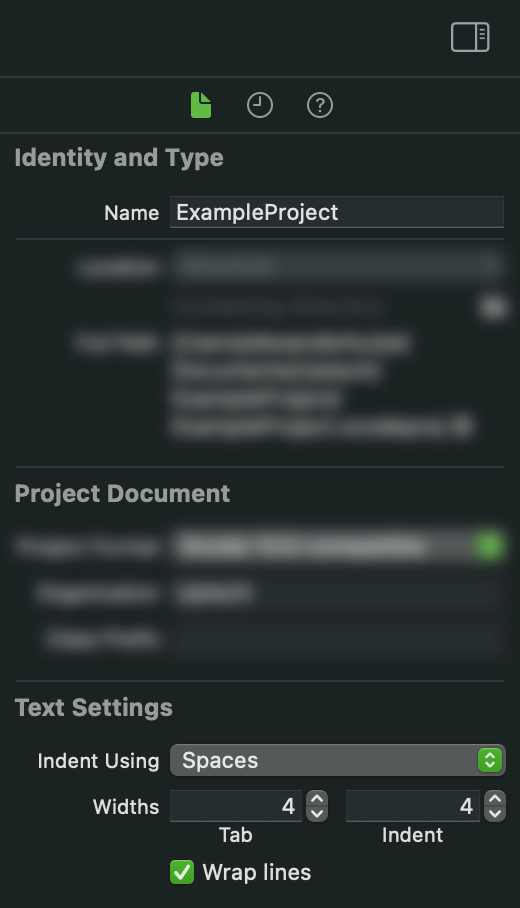

# Code Style

- [0. SwiftLint](#0-swiftlint)
- [1. Code Generation](#1-code-generation)
- [2. Code Formatting](#2-code-formatting)
- [3. Naming](#3-naming)
- [4. Coding Style](#4-coding-style)
    - [4.1 General](#41-general)
    - [4.2 Switch statements and enums](#42-switch-statements-and-enums)
    - [4.3 Optionals](#43-optionals)
    - [4.4 Protocols](#44-protocols)
    - [4.5 Closures](#45-closures)
    - [4.6 guard statements](#46-guard-statements)
- [5. Tagged](#5-tagged)
    - [5.1 Problem](#51-problem)
    - [5.2 Solution](#52-solution)
    - [5.3 Features](#53-features)
    - [5.4 Installation](#54-installation)

### 0. SwiftLint
We use [SwiftLint](https://github.com/realm/SwiftLint) to enforce Swift style and conventions. Recommended config file [.swiftlint.yml](https://gist.github.com/romanfurman6/c40443e8b337832bd91beb8fd81ed1aa).
### 1. Code Generation
We use [SwiftGen](https://github.com/SwiftGen/SwiftGen) to generate Swift wrappers for images, colors and localized strings.
### 2. Code Formatting
- Make sure you are familiar with [Apple's API Design Guidelines](https://swift.org/documentation/api-design-guidelines/).
- 
    <details>
    <summary>Use <b>4 spaces</b> for tab & indent width. This can be enforced for the whole project by setting it in <b>File inspector -> Text Settings</b> at its scope.</summary>
     Preferences -> Text Editing -> Indentation" width="70%"/>
     File inspector -> Text Settings" width="29%"/>
    </details>    
- 
    <details>
    <summary>Line character limit is <b>120 symbols</b>.</summary>
     Preferences -> Text Editing -> Display -> Page guide at column" width="80%"/>
    </details>
- 
    <details>
    <summary>Enable automatic trimming of trailing whitespaces and leading whitespaces for empty lines.</summary>
     Preferences -> Text Editing -> Editing -> While Editing" width="80%"/>
    </details>
- Don't put opening braces on new lines ([1TBS style](https://en.m.wikipedia.org/wiki/Indentation_style#1TBS)):
    ```swift
    class TestClass {
        func testFunc(value: Int) {
            guard value != .zero else {
                // code
                return
            }

            if value.isMultiple(of: 2) {
                // code
            } else {
                // code
            }
        }
    }
    ```
- Nested types should be located at the top of a parent type:
    ```swift
    struct Foo {
        struct Bar {}
   
        let bar: Bar
        let name: String 
    }

    class ViewController: UIViewController {
        struct Props {}

        enum Constants {}

        // code
    }
    ```
- When declaring a function that doesn't fit in 1 line - put its parameters on separate lines. Each argument and the return value should be on its line:
    ```swift
    func testFunc(
        firstArgument: Int, 
        secondArgument: Int, 
        thirdArgument: Int
    ) -> Int {
        // code
    }
    ```
- When calling a function that doesn't fit in 1 line - put each argument on a separate line with a single extra indentation:
    ```swift
    testFunc(
        firstArgument: 1,
        secondArgument: 2,
        thirdArgument: 3
    )
    ```
- Put spaces after comma:
    ```swift
    let array = [1, 2, 3, 4, 5]
    ```
- Put an extra line break before the next `case` in a `switch` for visual logic separation:
    ```swift
    switch task {
    case .doWork:
        // code

    case .ignoreThis, .ignoreThatToo:
        break
    }
    ```
- Do not put an empty line at the beginning and end of a type:
    ```swift
    // Preferred
    class MyView: UIView {
        private let someLabel = UILabel()
    }

    // Not Preferred
    class MyView: UIView {

        private let someLabel = UILabel()

    }
    ```
- Prefer using commas to the `&&` operator in `if` and `guard` predicates. Also, moving predicates logic to local constants dramatically improves code readability:
    ```swift
    // Preferred
    let firstCondition = x == firstPredicateFunction()
    let secondCondition = y <= secondPredicateFunction() + Constants.minimumBarrier
    let thirdCondition = z == thirdPredicateFunction() ?? fallbackFunction()
    if firstCondition, 
       secondCondition, 
       thirdCondition {
        // code
    }

    // Not Preferred
    if x == firstPredicateFunction()
        && y <= secondPredicateFunction() + Constants.minimumBarrier
        && z == thirdPredicateFunction() ?? fallbackFunction() {
        // code
    }
    ```
- Add a line break after `if` and `guard` statement:
    ```swift
    // Preferred 
    if condition {
        // code
    }

    guard condition else {
        return
    }

    // Not Preffered 
    if condition { // code }

    guard condition else { return }
    ```
- Put an empty line after `if` and `guard` closing bracket:
    ```swift
    // Preferred
    if condition {
        // code
    }

    // code

    guard condition else {
        return
    }

    // code

    // Not Preferred
    if condition {
        // code
    }
    // code

    guard condition else {
        return
    }
    // code
    ```
- For multi-conditioned `guard` statements, each subsequent condition should be positioned on the new line and be horizontally aligned with the preceding one:
    ```swift
    guard let description = config.description,
          let someCustomTypeValue = config.someCustomTypeValue 
    else {
	    return nil
    }
    ```
### 3. Naming
- We use `PascalCase` for `struct`, `enum`, `class`, `protocol`, `associatedtype` and `typealias` names.
- We use `camelCase` for functions, properties, variables, argument names and enum cases.
- Names of all types for a given screen usually contain the same prefix (e.g. `TemplatesPageListViewModel`, `TemplatesPageListViewController`, `TemplatesPageListView` etc). Sometimes the names are too long, so we use prefix abbreviations to name them (e.g. `TPLViewModel`, `TPLViewController`, `TPLView`).

    An alternative approach uses namespacing enums (e.g. `TemplatesPageList`), but this approach has a significant downside. When we put a controller in the namespacing extension, we cannot see enclosing type information in the memory debugger, only a bunch of `ViewController` objects.
    ```swift
    // Preferred
    class TPLViewModel {}

    class TPLViewController: UIViewController {}

    // Not Preferred
    enum TemplatesPageList {}

    extension TemplatesPageList {
        class ViewModel {}

        class ViewController: UIViewController {}
    }
    ```
- Do not use non-descriptive, shortened or single-letter names:
    ```swift
    // Preferred
    final class RoundAnimatingButton: UIButton {
        private let animationDuration: NSTimeInterval
  
        func startAnimating() {
            let firstSubview = subviews.first
            // code
        }
    }

    // Not Preferred
    final class RoundAnimating: UIButton {
        private let aniDur: NSTimeInterval
  
        func anim() {
            let a = subviews.first
            // code
        }
    }
    ```
- Include type information in constant/variable names when working with a subclass of `UIViewController` or `UIView`:
    ```swift
    // Preferred
    final class TestViewController: UIViewController {
        private let popupTableViewController: UITableViewController
  
        private let submitButton = UIButton()
        private let emailTextField = UITextField()
        private let nameLabel = UILabel()
    }

    // Not Preferred
    final class TestViewController: UIViewController {
        private let popup: UITableViewController
  
        private let submit = UIButton()
        private let email = UITextField()
        private let name = UILabel()
    }
    ```
- Provide labels for tuple members when it's hard to infer their purpose otherwise:
    ```swift
    // Preferred
    func analyze(numbers: [Int]) -> (average: Double, containsDuplicates: Bool) {
        // code
    }

    // Not Preferred
    func analyze(numbers: [Int]) -> (Double, Bool) {
        // code
    }
    ```
- Avoid using multiple shorthand argument names in a single closure - provide argument names for clarity:
    ```swift
    // Preferred
    applyChanges { currentValue, positiveDelta in
        currentValue + positiveDelta
    }

    // Not Preferred
    applyChanges {
        $0 + $1
    }
    ```
- When dealing with an acronym or other name usually written in all caps: use `Uppercase` if an abbreviation is in the middle of a name and `lowercase` if a `camelCase` name starts with it:
    ```swift
    final class URLFinder {}

    let htmlBodyContent = "<p>Hello, World!</p>"

    func setupUI() {}
    ```
### 4. Coding Style
#### 4.1 General
- Prefer `let` to `var` whenever possible.
- Do not explicitly declare types for constants or variables if they can be inferred. *But be aware that inferring a chain of closures will result in slower compilation time:*
    ```swift
    // Preferred
    let age = user.age
    let name = "John"

    // Not Preferred
    let age: Int = user.age
    let name: String = "John"
    ```
- Avoid writing out an enum type or nesting type of static variables where possible - use shorthand notation instead:
    ```swift
    // Preferred
    tableView.contentInset = .zero
    let textBounds = attributedString.boundingRect(
        with: size, 
        options: .usesLineFragmentOrigin, 
        context: nil
    )

    // Not Preferred
    tableView.contentInset = UIEdgeInsets.zero
    let textBounds = attributedString.boundingRect(
        with: size, 
        options: NSStringDrawingOptions.usesLineFragmentOrigin, 
        context: nil
    )
    ```
- Prefer the composition of `map`, `filter`, `reduce`, etc over iterating when transforming collections:
    ```swift
    // Preferred
    let evenNumbersSum = [4, 7, 10, 11, 13, 14, 18, 26]
        .filter({ number in number.isMultiple(of: 2) })
        .reduce(.zero, +)

    // Not Preferred
    var evenNumbersSum: Int = .zero
    let numbers = [4, 7, 10, 11, 13, 14, 18, 26]
    for number in numbers {
        if number % 2 == .zero {
            evenNumbersSum += number
        }
    }
    ```
- Do not use `return` in single-line functions and computed properties: 
    ``` swift
    func canExchangeAssets(for exchangeValue: Double) -> Bool {
        self.availableAssetsValue > exchangeValue
    }

    var availableAssetsValue: Double {
        self.price * self.count
    }
    ```
- Do not put parentheses around control flow predicates:
    ```swift
    // Preferred
    if x == y {
        // code
    }

    // Not Preferred
    if (x == y) {
        // code
    }
    ```
- If a variable or class is not intended to be overridden, apply `final` to it.
- When writing public methods, keep in mind whether the user should override the method or not. If not, mark it as `final`. *In general, `final` methods improve compilation time, so it is beneficial to use this when applicable.*
- Constants used two or more times should be `static` and stored in an `enum` named `Constants`.
#### 4.2 Switch statements and enums
- When defining a case with an associated value that isn't obvious, make sure that this value is appropriately labeled:
    ```swift
    // Preferred
    enum ViewState {
        case question(isUserActive: Bool)
    }

    // Not Preferred 
    enum ViewState {
        case question(Bool)
    }
    ``` 
- When extracting an associated value from an enum case, skip its label:
    ```swift
    // Preferred
    switch viewState {
    case let .alert(message):
        // code
    }

    // Not Preferred
    switch value {
    case .alert(message: let alertMessage):
        // code
    }
    ```
- When extracting multiple values from the enum case, prefer placing a single `var` or `let` annotation before the case name. You can also stick to this positioning for single associated value cases to keep the `case let` pattern consistent across the app:
    ```swift
    // Preferred
    switch value {
    case let .multiple(first, second, third):
        // code

    case let .single(first):
        // code
    }

    // Not Preferred
    switch value {
    case .multiple(let first, let second, let third):
        // code

    case .single(let first):
        // code
    }
    ```
- Avoid creating huge `case` statements. In general, if it takes more than **5** lines per `case`, consider grouping it into the method to keep the `switch` size reasonable:
    ```swift
    // Preferred
    switch viewState {
    case let .transitioning(props):
        renderTransitioningState(with: props)

    // code
    }

    // Not Preferred
    switch viewState {
    case let .transitioning(props):
        loadingIndicator.startAnimating()
        view.backgroundColor = props.backgroundColor
        view.alpha = props.alpha
        view.transform = props.transform
        view.headerView.render(with: props.headerProps)
        view.footerView.render(with: props.footerProps)
        
    // code
    }
    ```
- Do not include a `default` case for `switch` statements with a finite set of cases. Instead, place unused cases at the bottom of it and add `break`:
    ```swift
    // Preferred
    switch task {
    case .doWork:
        // code

    case .ignoreThis, .ignoreThatToo:
        break
    }

    // Not Preferred
    switch task {
    case .doWork:
        // code

    default:
        break
    }
    ```
- Prefer lists of cases to using the `fallthrough` keyword:
    ```swift
    // Preferred
    switch order {
    case .first, .second, .third:
        // code
    }

    // Not Preferred
    switch order {
    case .first:
        fallthrough

    case .second:
        fallthrough

    case .third:
        // code
    }
    ```
#### 4.3 Optionals
- The only time you should be using implicitly unwrapped optionals is when the resulting crash is a programmer's error (e.g., when resolving dependencies using [Dip](https://github.com/AliSoftware/Dip) or creating regular expressions).
- If you don't plan to use the value stored in an optional but need to check whether it is `nil` or not - explicitly check this value against `nil` instead of using the `if let` syntax:
    ```swift
    // Preferred
    if optionalValue != nil {
        // code
    }

    // Not Preferred
    if let _ = optionalValue {
        // code
    }
    ```
- When unwrapping optionals, prefer `guard let` statements to `if let` ones to avoid unnecessary nesting in your code.
- Avoid unwrapping optionals where optional chaining use is sufficient:
    ```swift
    // Preferred
    UIView.animate(withDuration: 0.3) { [weak animatingView] in
        animatingView?.alpha = .zero
        animatingView?.transform = .identity
    }

    // Not Preferred
    UIView.animate(withDuration: 0.3) { [weak animatingView] in
        guard let animatingView = animatingView else {
            return
        }

        animatingView.alpha = .zero
        animatingView.transform = .identity
    }
    ```
#### 4.4 Protocols
- If a `protocol` only has one possible conforming class (e.g., if the `protocol` acts as a wrapper for a unique `ViewModel`), it should be stored in the same source file with its concrete class implementation. Otherwise, keep it in a separate dedicated file.
- Keep all protocol conformance methods in a dedicated extensions *(1 extension per 1 protocol)*. Also, you can add `// MARK: - [Protocol name]` comments for improved readability and easier file navigation:
    ```swift
    // MARK: - UIScrollViewDelegate

    extension MyClass: UIScrollViewDelegate {
        // code
    }
    ```
#### 4.5 Closures
- Be careful when calling `self` from an escaping closure as this can cause a retain cycle - use a capture list when this might be the case:
    ```swift
    self.firstClosure = { [weak self] in 
        // code
    } 
    self.secondClosure = { [unowned self] in
        // code 
    }
    ```
- Prefer capturing individual variables to capturing `self` where applicable:
    ```swift
    // Preferred
    UIView.animate(withDuration: 0.3) { [weak animatingView] in
        animatingView?.alpha = .zero
        animatingView?.transform = .identity
    }

    // Not Preferred
    UIView.animate(withDuration: 0.3) { [weak self] in
        self?.animatingView.alpha = .zero
        self?.animatingView.transform = .identity
    }
    ```
- Use trailing closure syntax unless the purpose of the closure is not clear without the parameter name:
    ```swift
    // Preferred
    UIView.animate(withDuration: 0.3) { [weak animatingView] in
        animatingView?.alpha = .zero
        animatingView?.transform = .identity
    } completion: { _ in
        // code
    }
    removeUnlinkedEntries(completion: {
        // code
    })

    // Not Preferred
    UIView.animate(
        withDuration: 0.3,
        animations: { [weak animatingView] in
            animatingView?.alpha = .zero
            animatingView?.transform = .identity
        },
        completion: { _ in
            // code
        }
    )
    removeUnlinkedEntries {
        // code
    }
    ```
- If the types of the parameters are obvious - do not specify them explicitly. *Sometimes readability is enhanced by adding clarifying detail and sometimes by taking repetitive parts away*:
    ```swift
    // Preferred
    delegate.rowHeight { indexPath in
        dataSource[indexPath].expectedHeight
    }

    // Not Preferred
    delegate.rowHeight { (indexPath: IndexPath) -> CGFloat in
        dataSource[indexPath].expectedHeight
    }
    ```
#### 4.6 `guard` statements
- We prefer to use an early return strategy where applicable instead of nesting code in `if` statements:
    ```swift
	struct FailableConfig {
	    let value: Int
	    let description: String?
	    let someCustomTypeValue: CustomType?
	}
	
	init?(config: FailableConfig) {
	    guard let description = config.description,
              let someCustomTypeValue = config.someCustomTypeValue 
        else {
	        return nil
	    }
	  
	    // code
	}
    ```
- When you need to check if a condition is true and a failure should exit the current context - use `guard`:
    ``` swift
	// Preferred
	guard users.indices.contains(index) else {
	    return 
	}	

	// Not Preffered
	if users.indices.contains(index) {
        // code
	}
    ```
### 5. Tagged
`Tagged` is a wrapper for an additional layer of type-safety.

The main benefit that you will get is more clear code. And you don't have a chance accidentally set incorrect tagged value.


#### 5.1 Problem
There are cases when you want to distinguish IDs or any other primitive types like `String` or `Int` etc. And you're faced with a question of what particular value it represents.eg.

You have a usual struct like this.
``` swift 
struct User {
  let phone: String
  let email: String
  let advertisingID: UUID
  let vendorID: UUID
}
```

You run into API like this where you have several options what arguments you should pass.
``` swift 
func authenticateUser(credential: String)
func registerUser(id: UUID)
```
And you have to spend time looking for API documentation than makes comments or change functions.
<p>
Tagged can prevent bugs at compile time.
</p>

#### 5.2 Solution
We can improve `User` struct with Tagged types.

``` swift 
struct User {
  let phone: PhoneNumber
  let email: Email
  let advertisingID: AdvertisingID
  let vendorID: VendorID
}
```

When you have specifically indicated type `Email` and `AdvertisingID` you have no doubt what you should pass.
``` swift 
func authenticateUser(credential: Email)
func registerUser(id: AdvertisingID)
```


#### 5.3 Features
If rawValue conforms to `Codadble`, `Equatable`, `Hashable`, `Comparable` and `ExpressibleBy-Literal` family of protocols that mean `Tagged` conditionally conformed to them too.
<p>
Tagged is convenient in usage the only thing you should care about is to create a unique tag.
</p>

You can create typealiases in a separate file with a dedicated tags.
```swift 
enum EmailTag {}

typealias Email = Tagged<EmailTag, String>
```

Or you can do it directly inside the model.
```swift 
struct User {
  typealias ID = Tagged<User, Int>

  let id: ID // User.ID
}
```

#### 5.4 Installation
There are several ways to add it to the project.
<br>

`Carthage`
``` 
github "pointfreeco/swift-tagged" ~> 0.4
```
`CocoaPods`
``` Ruby
pod 'Tagged', '~> 0.4'
```
`SwiftPM` 
``` Swift
dependencies: [
  .package(url: "https://github.com/pointfreeco/swift-tagged.git", from: "0.4.0")
]
```

<br><b>References:</b>
- [GitHub repository](https://github.com/pointfreeco/swift-tagged)
- [Pointfree episode](https://www.pointfree.co/episodes/ep12-tagged)
