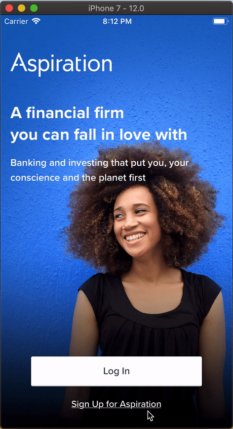

# UI Tests 📱

This chapter of the cookbook can be considered as `exploration stage` for the following reasons:

- First is that the team does not have a lot of experience with UI tests, 
- Second, this chapter only talks about the UI test tools that comes bundled with Xcode, and not some of the other options like [iOS Snapshot Test Case](https://github.com/uber/ios-snapshot-test-case), [EarlGrey](https://github.com/google/EarlGrey) and [KIF](https://github.com/kif-framework/KIF).

## Introduction

Xcode 7 introduced UI testing, which lets us to create a UI test by recording interactions with the UI. UI testing works by finding an app’s UI objects with queries, synthesizing events, then sending them to those objects. The API enables us to examine a UI object’s properties and state in order to compare them against the expected state.

UI tests tools that we get with Xcode rests upon two core technologies: the XCTest framework and Accessibility.

- __XCTest__ provides the framework for UI testings, expanding on the same tools you already know from your Unit tests, like XCTAssert and all its relatives!

- __Accessibility__. Yes, you might be asking yourself "why this guy started talking about Accessibility" right now, but it is not only related, but crucial to have UI tests! We use Accessibility tools that are normally are used for providing disabled users a good experience on iOS to also detect what is exposed for external use (the views that on the screen, interactable or not) and use that information for testing.

Main reason we need to use Accessibility to extract information about the UI state of the app is that UI testing is a [black-box testing](https://en.wikipedia.org/wiki/Black-box_testing) framework. We shouldn't have to know anything about the implementation of the code we are testing. We can think of UI testing from the perspective of the user. The user doesn't care how our `MassiveViewController` works (or even that it exists 😈), so why should the UI Tests?

## Getting Started

If your project doesn't already have a target for UI tests, you can add one by going to `File > New > Target..` in Xcode and select a “UI testing bundle”. Then edit your app’s scheme to run your UI tests when testing, by going to `Product > Scheme > Edit Scheme..` in Xcode and adding your UI testing bundle under “Test”.

Before we start with an example, let's talk about using Accessibility to identify views in UI tests. To give our UI elements accesibility identifiers, we can either use interface builder or do it in the implementation code.
  - To use interface builder to give an identifier we need to select the view, go to `Identity inspector` tab and set a value for `Identifier` field located in the `Accessibility` section.
  - To give the identifier in code, set `accessibilityIdentifier` of the view to the identifier string you want like following: `anyView.accessibilityIdentifier = "someIdentifierString"`

And also, one great side-effect of using `Accessibility` for UI tests is that it can help us make our apps accessible at the same time!


You can see the the gif below to see the flow we will be testing. Here we will test closing the view by tapping close button, closing the view by swiping down and entering credentials and tapping `Let's Go!` button to signup.



Now let's start with the example:

*(The comments that start with `*` will be the explanations for the chapter, and others are just regular comments.)*

```swift

import XCTest

class SignupUITests: XCTestCase {

    var app: XCUIApplication!

    override func setUp() {
        super.setUp()

        // * We set this property to false to end test execution as soon 
        // as a failure occurs, main reason is UI tests are slower than the 
        // unit tests and we don't want to wait to find out we have a problem.
        continueAfterFailure = false
        
        app = XCUIApplication()
        
        // * Here we pass launch arguments to `didFinishLaunchingWithOptions` 
        // in our AppDelegate. This is the only place where we can communicate 
        // with the app in UI tests since it is black-boxed, so we need to do 
        // any setup needed here. Names are self-explanatory but lets go over
        // anyway. CLEAN_STORAGE is used for resetting UserDefaults,
        // ALPHA_ENV is used for setting the environment and STUB_REQUESTS is
        // used for activating the network request stubbing.
        app.launchArguments.append(contentsOf: ["CLEAN_STORAGE", "ALPHA_ENV", "STUB_REQUESTS"])
    }

    func testSignup() {
        // * We launch to app to start testing. This is the most time consuming step
        // so we will combine all 3 tests and do them in one launch.
        app.launch()
      
        // * Preparing the views that we will check later if they exist. We are using 
        // the `accessibilityIdentifier`s that we gave to our views to find them
        let landingView = app.otherElements["LandingView"]
        let signupView = app.otherElements["SignupCardView"]
        let signupLoadingView = app.otherElements["SignupLoadingView"]

        // Test Closing with Close Button * First test
        app.openSignupScreen() // * Here we navigate to the screen we want to test
        // * This was added as an extension to `XCUIApplication` because it is 
        // used a lot of times. We need to navigate to the view we want to test.

        XCTAssert(signupView.waitForExistence(timeout: 5))
        // * Here we use .waitForExistence method to see if it appeared.

        // * Then we find the close button and tap on it to see if view is dismissed.
        let closeButton = app.buttons["SignupCardCloseButton"]
        closeButton.tap() // * Here we use tap method of XCUIElement.

        XCTAssert(landingView.waitForExistence(timeout: 5))
        // * We use waitForExistence method to see if landingView is visible after
        // dismissing SignupCardView

        // Test Closing with Swipe * Second Test
        app.openSignupScreen() // * Again we navigate to the screen we want to test
        
        XCTAssert(signupView.waitForExistence(timeout: 5))
        // * Again we use .waitForExistence method to see if it appeared.

        signupView.swipeDown()
        // * Here we use swipeDown method of XCUIElement, which sends a swipe-down 
        // gesture to our top view! One of the coolest things that UI testing tools 
        // allow us to do is using gestures.

        XCTAssert(landingView.waitForExistence(timeout: 5))
        // * Again we use waitForExistence method to see if landingView is visible after
        // dismissing SignupCardView

        // Test signing up * Third test
        app.openSignupScreen() // * Again we navigate to the screen we want to test

        XCTAssert(signupView.waitForExistence(timeout: 5))
        // * Again we use .waitForExistence method to see if it appeared.

        // * Here we are trying to get textfield inside another view, we know that 
        // it is the first subview of the container view so we use .firstMatch
        let emailField = app.otherElements["SignupEmailFieldContainer"].otherElements.firstMatch
        let passwordField = app.otherElements["SignupPasswordFieldContainer"].otherElements.firstMatch

        // * And we use the method we added in XCUIElement extension to clear 
        // old text(if there was any) and enter the new text.
        emailField.clearAndEnterText(text: "new.account@mail.com")
        passwordField.clearAndEnterText(text: "password123")

        app.buttons["SignupButton"].tap() // * We trigger a tap

        XCTAssert(signupLoadingView.waitForExistence(timeout: 5))
        // And we check if the next view after a successfull signup appears

    }
}

extension XCUIApplication {
    func openSignupScreen() {
        buttons["Sign Up"].tap()
    }
}

extension XCUIElement {
    /**
     Removes any current text in the field before typing in the new value
     - Parameter text: the text to enter into the field
     */
    func clearAndEnterText(text: String) {
        guard let stringValue = self.value as? String else {
            XCTFail("Tried to clear and enter text into a non string value")
            return
        }

        self.tap()

        let deleteString = stringValue.map { _ in XCUIKeyboardKey.delete.rawValue }.joined(separator: "")

        self.typeText(deleteString)
        self.typeText(text)
    }
}
```

## Learnings and Tips

#### 1. You can make your UI tests run faster by stubbing the network requests

We saw in the above example that we pass a launch argument called `STUB_REQUESTS`, which was used in AppDelegate to check if we should enable stubbing. For this we used a library called [OHHTTPStubs](https://github.com/AliSoftware/OHHTTPStubs). It is quite easy to use, you just need the JSON response, the `host` and `path` of the request you want to stub and the status code you want. You can also simulate slow networks!

#### 2. Don’t enable view's accessibility, and just use the identifier field

When you are giving identifiers to your UI elements, if you tick the `Enabled` checkbox under accessibility options in IB or if you set `isAccessibilityElement` `true` in code, you won't be able to detect any of the subviews and to detect, you will have to confirm to `UIAccessibilityContainer` to make subviews accessible as seperate elements.

#### 3. Sometimes you will have to find the container and access the children

Sometimes you won't be able to find your views in XCUIApplication.elements, for example it might not able to find a UITextfield subclass that is in another view for styling purpuses(even if you did not check `isAccessibilityElement`). Here you will have to find the container and then access the children like we did in the example with the textfields. ( `app.otherElements["SignupEmailFieldContainer"].otherElements.firstMatch` )

#### 4. You probably need to combine all tests for a screen in one `test` method.

Unlike unit tests, it takes A LOT of time to run all UI tests separetaly, so you can do one `func test..()` for a view with multiple asserts to combine all tests for that view. But not sure if this is a good approach to be honest. It is a trade-off between time and structure.

#### 5. You can use `Xcode Target`s to your advantage

While you are working on UI tests for a specific screen, you can create a specific target for this UI test and save some time by not running every UI test in the project!


## Should We Add UI Tests to Our Development Cycle?

This really depends on the project. For the regular projects where we are trying to firstly get the project by giving a good estimate and secondly trying to finish the project in this timeframe, UI tests might seem like a luxury. For projects that we are supporting, where the teams have more time for working on the project health, and where the client is willing, UI tests can be a nice addition and used as another tool to be used for maintaining project health.

What I think that might taken into consideration in future is that, there can be a workflow where our QA engineers write the UI tests for the projects, similar to automation tests on Web(or probably the same?). Couple of arguments for this is, one: UITests are blackbox tests, where the writer of the tests can find related elements either by static texts or the accessibility identifiers, and where the only tools are Xcode UITest tools and the debugger. Second argument is, this would give our QA engineers a deeper insight and understanding about our development tools and more technical knowledge. But it would require a lot of training probably, to find the views, to put the identifiers, since as it is it was hard for me to get around some problems, and by nature of my position I have more knowledge on the platform then a team member who is a QA engineer. 

But this is only taking into consideration the tools that Xcode gives us. We might be able to find an alternative(there are already some that seem promising like iOS Snapshot Test Case and EarlGrey) that is easier to use and let's us do faster implementation with less time wasted on querying the UI elements and on other XCUITest framework weirdness. And at that point it might be plausible to give this responsibility to the QA team.
