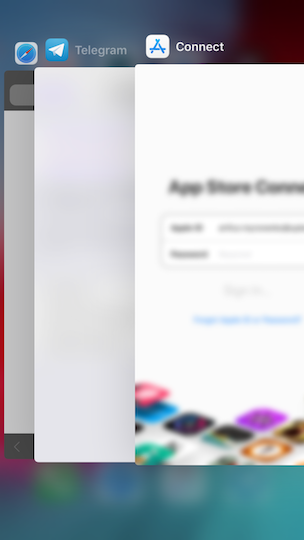

# Security <!-- omit in toc -->

Most users trust sensitive data to our applications and our goal is to protect that data.

## iOS Secure Coding Practices Checklist <!-- omit in toc -->

- [1. Minimize amount of data](#1-minimize-amount-of-data)
- [2. Always encrypt sensitive data](#2-always-encrypt-sensitive-data)
  - [2.1. Use Keychain](#21-use-keychain)
  - [2.2. Use iOS file encryption](#22-use-ios-file-encryption)
  - [2.3. Encrypt stored data with a symmetric key](#23-encrypt-stored-data-with-a-symmetric-key)
- [3. Keep your connection secure](#3-keep-your-connection-secure)
  - [3.1. Do not disable App Transport Security](#31-do-not-disable-app-transport-security)
  - [3.2. Use SSL pinning](#32-use-ssl-pinning)
- [4. Make your auth flow seamless](#4-make-your-auth-flow-seamless)
  - [4.1. Keep your access token lifetime reasonable](#41-keep-your-access-token-lifetime-reasonable)
  - [4.2. Use Password AutoFill in all sign-up and sign-in flows](#42-use-password-autofill-in-all-sign-up-and-sign-in-flows)
  - [4.3. Whenever possible, support biometric authentication](#43-whenever-possible-support-biometric-authentication)
  - [4.4. Use ASWebAuthenticationSession for OAuth](#44-use-aswebauthenticationsession-for-oauth)
- [5. Do not store keys in the code](#5-do-not-store-keys-in-the-code)
- [6. Validate custom URLs](#6-validate-custom-urls)
- [7. Care about your dependencies](#7-care-about-your-dependencies)
  - [7.1. Minimize permissions](#71-minimize-permissions)
  - [7.2. Monitor your dependencies](#72-monitor-your-dependencies)
- [8. Avoid showing sensitive data on screenshots](#8-avoid-showing-sensitive-data-on-screenshots)
- [9. Do not log sensitive data](#9-do-not-log-sensitive-data)

### 1. Minimize amount of data

- If the API responds with excessive responses containing a lot of unnecessary fields, talk to your backend team and ask them to return only required fields.

- Don't store redundant data.

### 2. Always encrypt sensitive data

Whenever you want to store a single `String` value or you would like to persist megabytes in CoreData you should never store it in plain text.

#### 2.1. Use [Keychain](https://developer.apple.com/documentation/security/keychain_services)

_Be careful with Keychain though. The items stored in the Keychain won't be removed when an application is uninstalled. The recommended approach is to wipe all Keychain data associated with an application when an app is first launched after installation._

#### 2.2. Use [iOS file encryption](https://developer.apple.com/documentation/uikit/core_app/protecting_the_user_s_privacy/encrypting_your_app_s_files)

On iOS 8 and above, files inside apps can be automatically using `NSFileProtection` whenever the device is locked.

```swift
do {
   try data.write(to: fileURL, options: .completeFileProtection)
}
```

#### 2.3. Encrypt stored data with a symmetric key

- User Defaults
- Files
- Database cells

Instead of writing plain text let's encrypt it! For example using [Themis](https://github.com/cossacklabs/themis/wiki/Swift-Howto):

```swift
let cellSeal = TSCellSeal(key: masterKeyData)!
let encryptedMessage = try! cellSeal.wrap("message".data(using: .utf8)!, context: nil)
userDefaults.set(encryptedMessage, forKey: "phoneNumber")
```

Or Realm built-in encryption:

```swift
// Generate a random encryption key
var key = Data(count: 64)
_ = key.withUnsafeMutableBytes { bytes in
  SecRandomCopyBytes(kSecRandomDefault, 64, bytes)
}

// Open the encrypted Realm file
let realm = try! Realm(configuration: Realm.Configuration(encryptionKey: key))
// Use the Realm as normal
let dogs = realm.objects(Dog.self).filter("name contains 'Fido'")
```

### 3. Keep your connection secure

#### 3.1. Do not disable App Transport Security

- Do not allow insecure communication over HTTP.
- Do not disable ATS by setting `NSAllowsArbitraryLoads`.
- If you really need to allow insecure communication with particular servers, use `NSExceptionDomains`:

```xml
<key>NSAppTransportSecurity</key>
<dict>
    <key>NSExceptionDomains</key>
    <dict>
        <key>appanalytics.company.com</key>
        <dict>
            <key>NSExceptionAllowsInsecureHTTPLoads</key>
            <true/>
        </dict>
    </dict>
</dict>
```

#### 3.2. Use [SSL pinning](https://www.owasp.org/index.php/Pinning_Cheat_Sheet)

- Alamofire (and thus Moya) supports SSL pinning with a few lines of code:

```swift
let policies: [String: ServerTrustPolicy] = [
  "test.example.com": ServerTrustPolicy.pinPublicKeys(
    publicKeys: ServerTrustPolicy.publicKeys(),
    validateCertificateChain: true,
    validateHost: true
  )
]

let sessionManager = SessionManager(
  serverTrustPolicyManager: ServerTrustPolicyManager(policies: policies)
)

let provider = MoyaProvider<AuthApi>(manager: sessionManager)
```

### 4. Make your auth flow seamless

#### 4.1. Keep your access token lifetime reasonable

Make it shorter for applications which process a significant amount of sensitive data.

#### 4.2. Use [Password AutoFill](https://developer.apple.com/documentation/security/password_autofill/) in all sign-up and sign-in flows

#### 4.3. Whenever possible, support [biometric authentication](https://developer.apple.com/documentation/localauthentication)

#### 4.4. Use [ASWebAuthenticationSession](https://developer.apple.com/documentation/authenticationservices/aswebauthenticationsession) for OAuth

### 5. Do not store keys in the code

```swift
  ⚠️
  let apiKey = "f2801f1b9fd1"
  let appId = "12312321"
```

Such keys can be easily parsed from the binary file by running `strings MyApp`.

It's better to obfuscate keys and secrets like described [here](https://medium.com/swift2go/increase-the-security-of-your-ios-app-by-obfuscating-sensitive-strings-swift-c915896711e6).

### 6. Validate custom URLs

For applications that support deep links, it's recommended to thoroughly validate the URL and prompt user before triggering any important action.

<details>
  <summary>Vulnerability Exploit Example</summary>

One example is the following bug in the Skype Mobile app, discovered in 2010: The Skype app registered the skype:// protocol handler, which allowed other apps to trigger calls to other Skype users and phone numbers. Unfortunately, Skype didn't ask users for permission before placing the calls, so any app could call arbitrary numbers without the user's knowledge.

Attackers exploited this vulnerability by putting an invisible `<iframe src="skype://xxx?call"></iframe>` (where xxx was replaced by a premium number), so any Skype user who inadvertently visited a malicious website called the premium number.

</details>

### 7. Care about your dependencies

#### 7.1. Minimize permissions

Dependencies included in your application have access to the same data as your app does. This means that allowing access to the camera makes it possible for the 3rd party libraries to access both iPhone cameras any time the app is running. More on that in [Felix's blog](https://krausefx.com/blog/ios-privacy-watchuser-access-both-iphone-cameras-any-time-your-app-is-running).

#### 7.2. Monitor your dependencies

Monitor each change to your dependency manager lockfile. [Even minor change can introduce major security risks.](https://blog.npmjs.org/post/180565383195/details-about-the-event-stream-incident)

**Each dependency is your responsibility.**

### 8. Avoid showing sensitive data on screenshots

iOS has the concept of saving a screenshot when the application goes into the background. This feature can pose a security risk because screenshots (which may display sensitive information such as an email or corporate documents) are written to local storage, where they can be recovered by a rogue application with a sandbox bypass exploit or someone who steals the device.

To avoid such risks it's recommended to clean up user interface when an app goes to the background:

```swift
func applicationDidEnterBackground(_ application: UIApplication) {
  let overlay = OverlayView()
  window?.addSubview(overlay)
}
```



### 9. Do not log sensitive data

Further Reading:

- https://www.apple.com/business/site/docs/iOS_Security_Guide.pdf
- https://github.com/OWASP/owasp-mstg#ios-testing-guide
